# EEWin — schéma complet de la base `EE`

> Document généré à partir de la **base vivante** rebâtie dans le conteneur Docker `eewin` (SQL Server 2022) avec les 52 scripts officiels de `eewin/scripts/` (journal `eewin/run.log` : 0 erreur). Toutes les colonnes, types, index et comptes de lignes ci-dessous viennent de `sys.tables`, `sys.columns`, `sys.indexes`, `sys.foreign_keys`, `sys.check_constraints`, `sys.triggers`, `sys.views`, `sys.partitions` et `OBJECT_DEFINITION()` interrogés le 2026-09-27 (heure de l'Est). Les requêtes exactes sont en annexe A. Chaque affirmation sémantique cite la procédure, la table/colonne ou la ligne de script qui la fonde ; ce qui n'est pas prouvé par le code est marqué **non prouvé**. Dans les tableaux de colonnes, une note qui cite une procédure ou un script (`sp_…`, `up_…`, `fn_…`, `Vnn_UpdateDatabase.sql:ligne`) est prouvée par ce code ; une note sans citation est une **lecture du nom de la colonne** — la colonne n'est alors lue par aucune procédure SQL autre que son CRUD, et son usage réel est dans le client Delphi. En particulier, `sp_SOU_CalculTotaux` ne lit **aucun** des totaux `SOUMIS.MAT*/SER*/AUT*` sauf pour écrire `*TAXAB1..5` : les colonnes `MATCOUTREL`, `SERHRESCAL`, `TAUXMD`, `TOTCALCULE`, etc. sont remplies par le client à partir des quatre valeurs que la procédure retourne.

## 1. Chiffres de la base

| Mesure | Valeur | Source |
|---|---|---|
| Tables | **60** | `sys.tables` |
| Colonnes | **1 061** | `sys.columns` |
| Procédures stockées | **160** | `sys.objects type='P'` |
| Fonctions | **18** (17 scalaires `FN` + 1 table `TF` : `FnGetColsFromString`) | `sys.objects type IN ('FN','TF','IF')` |
| Clés étrangères déclarées | **0** | `sys.foreign_keys` — et aucun `REFERENCES`/`FOREIGN KEY` dans les 52 scripts (`grep -il`) |
| Contraintes CHECK | 0 | `sys.check_constraints` |
| Déclencheurs | 0 | `sys.triggers` |
| Vues | 0 | `sys.views` |
| Index (PK incluses) | 106 | `sys.indexes` |
| Tables avec des données | 4 : `PROCORRESP` 84 721, `CATSTATUS` 20, `Sys_Units` 19, `Sys_UnitsConversion` 65 — **toutes les autres sont vides** (0 produit, 0 prix, 0 soumission) | `sys.partitions` |

Conséquence : **l'intégrité référentielle est entièrement portée par le code** (procédures SQL et client Delphi). Les relations dessinées dans l'ERD (§ 3) sont *déduites* des jointures écrites dans les procédures — chaque flèche cite la procédure qui la réalise.

## 2. Conventions transversales (constatées sur les 60 tables)

- `UniqueId bigint IDENTITY` est la PK clustered de **40** tables (`PK_<TABLE>`). 5 tables ont une autre PK : `BDEE_MULTI` (`DistributorCode`), `EULA` (`ULA_ID`), `EULAUSER` (`ULA_ID, USER`), `Sys_Units` (`UnitId`), `Sys_UnitsConversion` (`ConversionId`). **15 tables n'ont aucune PK** : `CATSTATUS`, `PROCORRESP`, `PriceUpdate_Products`, `TOOLSQLSCRIPT`, `UM_AREAS`, `UM_BRANCHS`, `UM_BUSINESSUNIT`, `UM_REGIONS`, `UM_USERREGIONS`, `UM_USERS`, `USERSESSION`, `USR_GRIDVIEW`, `USR_GRIDVIEWCOL`, `_DBVersion`, `_TransferCompleted` (la plupart n'ont qu'un `UniqueId` identity sans contrainte).
- La **clé fonctionnelle** est toujours un `varchar(20)` nommé `<XXX>_ID` (`SOU_ID`, `PRO_ID`, `ENS_ID`, `LOTS_ID`, `CLI_ID`, `COM_ID`, `TAX_ID`, `USER_ID`…) ; les `BLO_ID`/`DIV_ID` font 3 caractères. Les jointures inter-tables se font sur ces clés, jamais sur `UniqueId`.
- Les tables enfants d'une soumission portent un index non-unique nommé `IDX_UNIQUEKEY` sur `(SOU_ID, …)` — malgré son nom il n'est **pas** déclaré `UNIQUE` (`sys.indexes.is_unique = 0` pour les 21 occurrences).
- `SysDate datetime NOT NULL` : horodatage d'insertion présent sur 55 tables, avec `DEFAULT getdate()` sur 54 (`BDEE_MULTI` n'a pas de défaut).
- `ORDRE varchar(6)` : ordre d'affichage textuel (`'011000'`, incrément de 1000 dans `up_CopySouBlocDiv`).
- Toute colonne `*UM` (`COUUM`, `QTEUM`, `TEMPUM`, `DIVUM`, `FRAISUM`) est un code `Sys_Units.CodeEN` (2 car.).
- `ACC_NO` / `ACH_NO` / `ACT_NO` (comptes comptable / achat / activité, 20 car.) : présents (`INFORMATION_SCHEMA.COLUMNS`) sur `PROCAT`, `CLITAUX`, `FRAIS`, `TAUX`, `SOUREL`/`FACREL` (les trois), `PRODUITS`, `DEFBLO`, `SOUBLO`/`FACBLO` (`ACC_NO`, `ACH_NO`), `DEFDIV`, `SOUDIV`/`FACDIV` (`ACT_NO` seul) ; ajoutés par les commentaires `-- New field` de V11 (toutes sauf `PRODUITS`) et V45 (`PRODUITS.ACC_NO/ACH_NO`).
- `INCLSOU` / `INCLFAC` / `SYSTEM` (bit) sur les listes de référence : inclure dans une nouvelle soumission / facture ; enregistrement système non supprimable.
- La plupart des tables ont leur couple `up_<TABLE>_Update` (upsert par `UniqueId`, retourne l'identité) et `up_<TABLE>_Delete` — 106 des 160 procédures sont de ce type (8 tables n'ont qu'une des deux : `BDEE_MULTI`, `EULA`, `EULAUSER`, `FACWEBLOGL`, `PROCORRESP`, `SOUWEBLOGL`, `UM_BUSINESSUNIT`, `USERSESSION`). 19 des 23 `up_SOU*_Update/Delete` appellent `sp_Update_SoumisUseSession` (pas `up_SOUBLO_Update`, `up_SOUDIV_Update`, `up_SOUMIS_Delete`, `up_SOUWEBLOG_Delete`) et 19 `up_FAC*` appellent `sp_Update_FacturesUserSession` (`grep -l` sur les définitions) pour tracer `USER_ID_UP/USER_UPDATE`.
- Le client est écrit en **Delphi** (commentaire `-- TO_CopyPaste en Delphi`, `up_CopySoumis_Full`, V25_UpdateDatabase.sql:37) ; une bonne part des règles métier (taux, frais, blocs par défaut, statuts) n'existe qu'en CRUD côté SQL.
- Version « Calgary » : `EE_Calgary()` retourne 1 si la colonne `PRODUITS.LC` (landed cost) existe (V22_UpdateDatabase.sql:813). Dans cette base **elle n'existe pas** → `EE_Calgary() = 0`, le moteur utilise `CoutantNetReel` et non `LandedCost`.

## 3. ERD (relations déduites du code)

```mermaid
erDiagram
    %% ---------- Catalogue
    PROCAT ||--o{ PRODUITS : "CODECAT [non vérifié] (up_PriceUpdate_UpdateProducts écrit PRODUITS.CODECAT sans lire PROCAT)"
    PRODUITS ||--o{ ENSCOMPO : "PRO_ID (upbi_ProductsPrefered_BatchAssign)"
    ENSEMBLE ||--o{ ENSCOMPO : "ENS_ID (IDX_ENS_ID) [non vérifié]"
    PriceUpdate_Products }o--|| PRODUITS : "PRO_ID (up_PriceUpdate_UpdateProducts)"

    %% ---------- Soumission
    CLIENTS ||--o{ SOUMIS : "CLI_ID = CLIENTNO (IDX_CLIENTNO) [non vérifié]"
    TAXDEF ||--o{ SOUMIS : "TAX_ID (sp_SOU_CalculTotaux)"
    CATSTATUS ||--o{ SOUMIS : "ORDRE = STATUT, TYPECAT='SOU' [non vérifié : STATUT int vs ORDRE varchar(6)]"
    UM_USERS ||--o{ SOUMIS : "USER_ID [non vérifié]"
    SOUMIS ||--o{ SOUBLO : "SOU_ID (up_DeleteSoumis_Full)"
    SOUMIS ||--o{ SOUDIV : "SOU_ID (up_DeleteSoumis_Full)"
    SOUMIS ||--o{ SOUAMD : "SOU_ID (up_DeleteSoumis_Full)"
    SOUMIS ||--o{ SOUREL : "SOU_ID"
    SOUMIS ||--o{ SOUPRO : "SOU_ID"
    SOUMIS ||--o{ SOUENS : "SOU_ID"
    SOUMIS ||--o{ SOULOTS : "SOU_ID"
    SOUMIS ||--o{ SOUWEBLOG : "SOU_ID (up_DeleteSoumis_Full)"
    SOUBLO ||--o{ SOUREL : "BLO_ID (fn_MultBlock)"
    SOUDIV ||--o{ SOUREL : "DIV_ID (fn_GetProductCompositionConcat)"
    SOUBLO ||--o{ SOUAMD : "BLO_ID (sp_SOU_CalculTotaux)"
    SOUDIV ||--o{ SOUAMD : "DIV_ID (sp_SOU_CalculTotaux)"
    SOUREL }o--|| SOUPRO : "ITEM_ID=PRO_ID si TYPEITEM in (P,N)"
    SOUREL }o--|| SOUENS : "ITEM_ID=ENS_ID si TYPEITEM=A"
    SOUREL }o--|| SOULOTS : "ITEM_ID=LOTS_ID si TYPEITEM=L"
    SOUENS ||--o{ SOUENSCO : "SOU_ID+ENS_ID (sp_SOU_CalculTotaux)"
    SOUPRO ||--o{ SOUENSCO : "SOU_ID+PRO_ID (sp_SOU_CalculTotaux)"
    SOULOTS ||--o{ SOULOTSCO : "SOU_ID+LOTS_ID (sp_SOU_CalculTotaux)"
    SOUPRO ||--o{ SOULOTSCO : "SOU_ID+PRO_ID (sp_SOU_CalculTotaux)"
    PRODUITS ||--o{ SOUPRO : "PRO_ID copié (snapshot)"
    ENSEMBLE ||--o{ SOUENS : "ENS_ID copié (ENS_ORG_ID)"
    TAXDEF ||--o{ SOUREL : "TYPETAXE = CODETAX1..5"

    %% ---------- Facture (miroir exact)
    SOUMIS ||--o| FACTURES : "sp_FAC_SOU_Copy (SOU_ID -> FactID)"
    FACTURES ||--o{ FACREL : "SOU_ID (up_DeleteFactures_Full)"
    FACTURES ||--o{ FACPRO : "SOU_ID (up_DeleteFactures_Full)"
    FACTURES ||--o{ FACENS : "SOU_ID (up_DeleteFactures_Full)"
    FACENS ||--o{ FACENSCO : "SOU_ID+ENS_ID (sp_FAC_CalculTotaux)"
    FACTURES ||--o{ FACLOTS : "SOU_ID (up_DeleteFactures_Full)"
    FACLOTS ||--o{ FACLOTSCO : "SOU_ID+LOTS_ID (sp_FAC_CalculTotaux)"
    FACTURES ||--o{ FACBLO : "SOU_ID (up_DeleteFactures_Full)"
    FACTURES ||--o{ FACDIV : "SOU_ID (up_DeleteFactures_Full)"
    FACTURES ||--o{ FACAMD : "SOU_ID (up_DeleteFactures_Full)"
    FACTURES ||--o{ FACWEBLOG : "SOU_ID (up_DeleteFactures_Full)"

    %% ---------- Commande
    SOUMIS ||--o{ COMMANDE : "SOU_ID [non vérifié]"
    CLIENTS ||--o{ COMMANDE : "CLI_ID = ORDERED_ID [non vérifié]"
    COMMANDE ||--o{ COMMITEM : "COM_ID (IDX_COM_ID) [non vérifié]"
    PRODUITS ||--o{ COMMITEM : "PRO_ID (upbi_ProductsPrefered_BatchAssign)"
    CATSTATUS ||--o{ COMMANDE : "TYPECAT='COM' [non vérifié]"

    %% ---------- Référence
    CLIENTS ||--o{ CLITAUX : "CLI_ID (IDX_UNIQUEKEY) [non vérifié]"
    Sys_Units ||--o{ Sys_UnitsConversion : "UnitFrom/UnitTo (fn_UM_GetRatioDeConversion)"
    UM_BUSINESSUNIT ||--o{ UM_BRANCHS : "BU_ID [non vérifié]"
    UM_REGIONS ||--o{ UM_AREAS : "REGION_ID [non vérifié]"
    UM_AREAS ||--o{ UM_BRANCHS : "AREA_ID [non vérifié]"
    UM_BRANCHS ||--o{ UM_USERS : "BRANCH_ID [non vérifié]"
    UM_USERS ||--o{ UM_USERREGIONS : "USER_ID [non vérifié]"
    UM_USERS ||--o{ USERSESSION : "USER_ID (GetCurrentUserSession)"
    EULA ||--o{ EULAUSER : "ULA_ID [non vérifié]"
    USR_GRIDVIEW ||--o{ USR_GRIDVIEWCOL : "VIEW_ID [non vérifié]"
```

Légende : `||--o{` = 1..n. **Aucune relation n'est une FK déclarée** (`sys.foreign_keys` = 0). Une flèche dont le commentaire nomme une procédure ou une fonction (`sp_…`, `up_…`, `fn_…`, `upbi_…`) est une jointure ou une cascade trouvée dans ce code. Une flèche dont le commentaire ne cite qu'un index (`IDX_…`) ou un nom de colonne est **déduite des noms de colonnes** — aucune routine SQL ne la réalise (`grep -w <TABLE>` sur les 178 définitions ne trouve que le CRUD) ; elle est marquée `[non vérifié]`.



Tables hors relations : `BDEE`, `BDEE_MULTI`, `PROCORRESP`, `PROGLOSS`, `PROFGRID`, `DEFBLO`, `DEFDIV`, `NOTES`, `IMPRIMER`, `TAUX`, `FRAIS`, `TOOLSQLSCRIPT`, `_DBVersion`, `_TransferCompleted` (aucune jointure vers elles dans les 178 routines ; CRUD seulement).

## 4. Ce que chaque domaine veut dire pour une estimation électrique

Le flux complet, tel que le code le réalise :

1. **Catalogue** (`PRODUITS`) : le prix distributeur de chaque article et le temps de pose unitaire que l'estimateur y attache.
2. **Ensembles** (`ENSEMBLE`/`ENSCOMPO`) : la recette « une prise = boîte + prise + plaque + câble + connecteurs + temps ». C'est l'unité de relevé sur le plan : Plan Expert compte des ensembles, pas des produits.
3. **Relevé** (`SOUREL`) : le compte de chaque ensemble/produit/lot par bloc et division, avec la quantité et l'unité.
4. **Explosion** (`sp_SOUPRO_Quantity_V2` → `sp_SOU_UpdateQteTotal{Oth,Ens,Lots}_v2`) : les ensembles relevés sont explosés en quantités de produits dans `SOUPRO.QTEENS/QTELOT/QTEOTH`, converties dans l'**unité de base** de l'unité de coût du produit (`fn_UM_GetRatioDeConversion(…, fn_UM_GetUniteDeBase(SP.COUUM), SP.QPP)` — ex. `F` pour un coût en `CF`) et multipliées par le `MULT` du bloc (`fn_MultBlock`).
5. **Chiffrage** (`sp_SOU_CalculTotaux`) : pour chaque ligne du relevé — coût net réel (`PROMCOUNET` sinon brut − escompte), coût total, vendant (profit en mode coût `C` ou marge `G`), TVP sur coût si permise, temps de pose × facteur main-d'œuvre (`SOUAMD.FACTMD`) × `MULT`, montants taxables par tranche (`TAXDEF`). Le résultat retourné est `fCoutantTotal, fCoutantTotalPortionTVP, fVendantTotal, fLaborTotal` et les `MAT/SER/AUTTAXAB1..5` de `SOUMIS` sont écrits.
6. **Facture** (`FAC*`) : copie intégrale de la soumission acceptée ; **commande** (`COMMANDE`) : bon d'achat des produits de `SOUPRO`.


## Domaine — Catalogue de produits

Pour l'estimation : c'est ici que vivent **le prix** (`COUBRUTUNI`, `COUESC`, `PROMCOUNET`) et **le temps de pose** (`TEMPUNI`/`TEMPUM`) de chaque article. Dans la base rebâtie ces tables sont vides : le package V14 livre le schéma et les correspondances de clés, pas le catalogue de prix de M. Dupuis. Le pont avec les QPL est double : les items `ItemType="P"` des QPL portent un `ItemID` de la forme `LQE008445` (= `PRODUITS.PRO_ID`, préfixe de division `LQE`) et un `Key` (= `CLEMANU`, ex. `IBE52171K`).

### `PRODUITS`

Le catalogue de prix. Une ligne par article (fil, conduit, boîte, appareillage…). La table est alimentée par les listes de prix des distributeurs via la table de transit `PriceUpdate_Products` (`up_PriceUpdate_UpdateProducts`, V22_UpdateDatabase.sql:844) et enrichie par l'estimateur (clé personnelle, description, temps d'installation, profit).

- Créée dans `eewin/scripts/CreateTables.sql:527` — 39 colonnes — lignes dans la base rebâtie : **0**.

**Index**

| Index | Type | Colonnes |
|---|---|---|
| `PK_PRODUITS` | PK CLUSTERED | UniqueId |
| `IDX_CLEDIST` | NONCLUSTERED | CLEDIST |
| `IDX_CLEMANU` | NONCLUSTERED | CLEMANU |
| `IDX_CLEPERS` | NONCLUSTERED | CLEPERS |
| `IDX_CODECAT` | NONCLUSTERED | CODECAT |
| `IDX_CODEUPC` | NONCLUSTERED | CODEUPC |
| `IDX_NOUVEAU` | NONCLUSTERED | NOUVEAU |
| `IDX_PRO_ID` | NONCLUSTERED | PRO_ID |

**Colonnes**

| # | Colonne | Type | Null | Défaut | Clé | Note |
|---|---|---|---|---|---|---|
| 1 | `UniqueId` | bigint | NOT NULL |  | PK IDENTITY |  |
| 2 | `PRO_ID` | varchar(20) |  |  |  | Identifiant produit. Les 3 premiers caractères sont le code de division/distributeur : `LEFT(PRO_ID,3) IN ('NWE','NOE','NQE','NME','WAE','WME','WOE','WQE','LQE','GSE','SOE')` dans `up_PriceUpdate_UpdateProducts`. Les PRO_ID de 20 caractères sont exclus de la mise au rancart (`LEN(PRO_ID) <> 20`, `up_PriceUpdate_DiscontinueProducts`). Ex. QPL : `LQE008445`. |
| 3 | `CLEMANU` | varchar(30) |  |  |  | Clé manufacturier (30 car. depuis V13_UpdateDatabase.sql:287, `ALTER TABLE dbo.PRODUITS ALTER COLUMN CLEMANU VARCHAR(30)`). C'est le `Key` des items `ItemType="P"` dans les QPL (ex. `IBE52171K`). |
| 4 | `CLEPERS` | varchar(20) |  |  |  | Clé personnelle de l'estimateur ; `CLEPERS <> ''` = candidat « produit préféré » (`upbi_ProductsPrefered_BatchAssign`). |
| 5 | `CLEDIST` | varchar(20) |  |  |  | Clé distributeur (chargée par `PriceUpdate_Products`). |
| 6 | `CODEUPC` | varchar(12) |  |  |  | Code UPC personnel ; écrasé par le UPC distributeur seulement s'il est vide ou égal à CODEUPCDIS (`up_PriceUpdate_UpdateProducts`). |
| 7 | `CODECAT` | varchar(3) |  |  |  | Catégorie → `PROCAT.CODECAT`. Une catégorie qui commence par `+` ou `#` est « système » et peut être écrasée par la mise à jour de prix (`up_PriceUpdate_UpdateProducts`). |
| 8 | `DESCDIST` | varchar(60) |  |  |  | Description du distributeur. |
| 9 | `DESC` | varchar(60) |  |  |  | Description personnelle ; remplacée par la description distributeur uniquement si vide ou égale à DESCDIST (`up_PriceUpdate_UpdateProducts`). |
| 10 | `COUBRUTUNI` | float |  |  |  | Coût brut unitaire (prix de liste). Coût net réel = `PROMCOUNET` si > 0, sinon `COUBRUTUNI - COUBRUTUNI*COUESC/100` (`sp_SOU_CalculTotaux`). |
| 11 | `COUUM` | varchar(2) |  |  |  | Unité de mesure du coût → `Sys_Units.CodeEN` (U, C, K, M, F, CF, KF…). |
| 12 | `QPP` | float |  |  |  | Quantité par paquet ; sert au ratio paquet→unité `1/QPP` (`fn_UM_GetRatioDeConversion`). |
| 13 | `COUESC` | float |  |  |  | Escompte (%) appliqué au coût brut. |
| 14 | `PROMCOUNET` | float |  |  |  | Coût net spécial/promotionnel ; prime sur le calcul brut-escompte quand > 0. |
| 15 | `PROFIT` | float |  |  |  | Profit (%) par défaut du produit. |
| 16 | `MULCOM` | float |  |  |  | Multiple de commande (chargé de `PriceUpdate_Products.MULCOM`). |
| 17 | `TEMPUNI` | float |  |  |  | Temps d'installation unitaire (main-d'œuvre). Temps total d'une ligne = `QTE * TEMPUNI * ratio(QTEUM → TEMPUM)` (`sp_SOU_CalculTotaux`). |
| 18 | `TEMPUM` | varchar(2) |  |  |  | Unité du temps d'installation (unité de quantité à laquelle TEMPUNI s'applique). |
| 19 | `CODEFOUR` | varchar(2) |  |  |  | Code fournisseur : `WE` (défaut), `NE` si PRO_ID commence par N, `LE` si L, `GE` si G, `SE` si S (`up_PriceUpdate_UpdateProducts`). |
| 20 | `NOUVEAU` | varchar(1) |  |  |  | Drapeau « nouveau produit » de la liste de prix (`PriceUpdate_Products.NOUVEAU`) ; remis à `N` au rancart. |
| 21 | `DNR` | varchar(1) |  |  |  | Mis à `Y` par `up_PriceUpdate_DiscontinueProducts` (produit absent de la dernière liste de prix de sa division), `N` sinon. |
| 22 | `DATECOUT` | datetime |  |  |  | Date de la liste de prix (`PriceUpdate_Products.DATECOUT`). |
| 23 | `DATECREE` | datetime |  |  |  |  |
| 24 | `PATHPICT` | varchar(60) |  |  |  | Chemin image. |
| 25 | `PATHSPEC` | varchar(60) |  |  |  | Chemin fiche technique. |
| 26 | `IMAGE` | varchar(1) |  |  |  |  |
| 27 | `USER1` | varchar(20) |  |  |  |  |
| 28 | `USER2` | varchar(20) |  |  |  |  |
| 29 | `SysDate` | datetime | NOT NULL | `(getdate())` |  |  |
| 30 | `DATECOUNET` | datetime |  |  |  | Date de la dernière mise à jour du prix net (V7) ; si NULL, les prix sont initialisés à 0 à l'ajout, sinon jamais touchés par la MAJ de liste (`up_PriceUpdate_UpdateProducts`). |
| 31 | `RESCOUNET` | int |  |  |  | Ajouté en V7_UpdateDatabase.sql:21 avec DATECOUNET (résultat de la MAJ prix net ; aucune procédure SQL ne le lit). |
| 32 | `PREFERED` | varchar(1) |  |  |  | Produit préféré (V8) ; assigné en lot par `upbi_ProductsPrefered_BatchAssign` selon clé perso / ensembles / commandes / soumissions / factures. |
| 33 | `PRO_ID_NEW` | varchar(20) |  |  |  | V9 : nouveau PRO_ID lors d'une correspondance de clé. |
| 34 | `PRO_ID_OLD` | varchar(20) |  |  |  | V9 : ancien PRO_ID. |
| 35 | `CODEUPCDIS` | varchar(12) |  |  |  | UPC du distributeur (V15). |
| 36 | `SHOWONWEB` | varchar(1) |  | `('1')` |  | V19 ; défaut `'1'`. |
| 37 | `PRO_ID_Parent` | varchar(20) |  |  |  | V44_UpdateDatabase.sql:20. |
| 38 | `ACC_NO` | varchar(20) |  |  |  | Compte comptable (V45_UpdateDatabase.sql:3). |
| 39 | `ACH_NO` | varchar(20) |  |  |  | Compte d'achat (V45_UpdateDatabase.sql:20). |

### `PROCAT`

Catégories de produits (3 caractères) avec comptes comptables associés.

- Créée dans `eewin/scripts/CreateTables.sql:518` — 7 colonnes — lignes dans la base rebâtie : **0**.

**Index**

| Index | Type | Colonnes |
|---|---|---|
| `PK_PROCAT` | PK CLUSTERED | UniqueId |

**Colonnes**

| # | Colonne | Type | Null | Défaut | Clé | Note |
|---|---|---|---|---|---|---|
| 1 | `UniqueId` | bigint | NOT NULL |  | PK IDENTITY |  |
| 2 | `CODECAT` | varchar(3) |  |  |  | Code catégorie (3 car.) référencé par `PRODUITS.CODECAT` et `SOUPRO.CODECAT`. |
| 3 | `DESC` | varchar(40) |  |  |  | Libellé. |
| 4 | `SysDate` | datetime | NOT NULL | `(getdate())` |  |  |
| 5 | `ACC_NO` | varchar(20) |  |  |  | Compte comptable (V11). |
| 6 | `ACH_NO` | varchar(20) |  |  |  | Compte d'achat (V11_UpdateDatabase.sql:2587). |
| 7 | `ACT_NO` | varchar(20) |  |  |  | Compte d'activité (V11_UpdateDatabase.sql:3422). |

### `PROCORRESP`

Table de correspondance ancienne clé → nouvelle clé lors d'un changement de division/distributeur. **Seule table livrée avec des données métier : 84 721 lignes** (chargées par V14_UpdateDatabase.sql à partir de la ligne 6). Répartition observée (`GROUP BY OLDDIV, NEWDIV`) : WOE→SOE 3 471, NOE→SOE 26 606, WQE→LQE 26 606, NQE→LQE 20 251, NWE→GSE 2 252, WAE→GSE 5 535.

- Créée dans `eewin/scripts/V13_UpdateDatabase.sql:266` — 7 colonnes — lignes dans la base rebâtie : **84721**.

**Index**

_Aucun index (heap)._

**Colonnes**

| # | Colonne | Type | Null | Défaut | Clé | Note |
|---|---|---|---|---|---|---|
| 1 | `UniqueId` | bigint | NOT NULL |  | IDENTITY |  |
| 2 | `OLDDIV` | varchar(3) |  |  |  | Ancienne division (3 car., ex. `WQE`, `NOE`, `NQE`, `WOE`, `NWE`, `WAE`). |
| 3 | `OLDCLEMANU` | varchar(30) |  |  |  | Ancienne clé manufacturier. |
| 4 | `NEWDIV` | varchar(3) |  |  |  | Nouvelle division (ex. `LQE`, `SOE`, `GSE`). |
| 5 | `NEWCLEMANU` | varchar(30) |  |  |  | Nouvelle clé manufacturier. |
| 6 | `SysDate` | datetime | NOT NULL | `(getdate())` |  |  |
| 7 | `ISUSER` | varchar(120) |  |  |  | V16 : correspondance saisie par l'utilisateur (NULL pour les 84 721 lignes livrées par V14). |

### `PROGLOSS`

Glossaire de produits (catégorie / sous-catégorie / code) rechargé avec les listes de prix.

- Créée dans `eewin/scripts/CreateTables.sql:572` — 8 colonnes — lignes dans la base rebâtie : **0**.

**Index**

| Index | Type | Colonnes |
|---|---|---|
| `PK_PROGLOSS` | PK CLUSTERED | UniqueId |

**Colonnes**

| # | Colonne | Type | Null | Défaut | Clé | Note |
|---|---|---|---|---|---|---|
| 1 | `UniqueId` | bigint | NOT NULL |  | PK IDENTITY |  |
| 2 | `TYPEGLOSS` | varchar(2) |  |  |  | Type de glossaire. |
| 3 | `CATEGORIE` | varchar(30) |  |  |  |  |
| 4 | `SOUSCAT` | varchar(30) |  |  |  |  |
| 5 | `CODE` | varchar(20) |  |  |  |  |
| 6 | `DESCRIPTIO` | varchar(50) |  |  |  |  |
| 7 | `CODEBANK` | varchar(3) |  |  |  | Banque (3 car.) ; vidé/rempli par `up_PriceUpdate_ClearGlossary` / `up_PriceUpdate_InsertGlossary`. |
| 8 | `SysDate` | datetime | NOT NULL | `(getdate())` |  |  |

### `PROFGRID`

Grille de profit par tranche de prix et unité.

- Créée dans `eewin/scripts/CreateTables.sql:561` — 6 colonnes — lignes dans la base rebâtie : **0**.

**Index**

| Index | Type | Colonnes |
|---|---|---|
| `PK_PROFGRID` | PK CLUSTERED | UniqueId |

**Colonnes**

| # | Colonne | Type | Null | Défaut | Clé | Note |
|---|---|---|---|---|---|---|
| 1 | `UniqueId` | bigint | NOT NULL |  | PK IDENTITY |  |
| 2 | `UM` | varchar(2) |  |  |  | Unité. |
| 3 | `PRIXBAS` | float |  |  |  | Borne basse de prix. |
| 4 | `PRIXHAUT` | float |  |  |  | Borne haute. |
| 5 | `PROFIT` | float |  |  |  | Profit (%) applicable dans cette tranche. CRUD seulement côté SQL. |
| 6 | `SysDate` | datetime | NOT NULL | `(getdate())` |  |  |

### `PriceUpdate_Products`

Table de transit (sans PK, un seul index sur PRO_ID) dans laquelle le client charge une liste de prix avant `up_PriceUpdate_UpdateProducts`.

- Créée dans `eewin/scripts/CreateTables.sql:950` — 18 colonnes — lignes dans la base rebâtie : **0**.

**Index**

| Index | Type | Colonnes |
|---|---|---|
| `IDX_PRO_ID` | NONCLUSTERED | PRO_ID |

**Colonnes**

| # | Colonne | Type | Null | Défaut | Clé | Note |
|---|---|---|---|---|---|---|
| 1 | `PRO_ID` | varchar(20) |  |  |  | Clé de jointure vers `PRODUITS.PRO_ID` (`up_PriceUpdate_UpdateProducts`) ; table de transit sans PK. |
| 2 | `DESC` | varchar(60) |  |  |  |  |
| 3 | `CODECAT` | varchar(3) |  |  |  |  |
| 4 | `COUUM` | varchar(2) |  |  |  |  |
| 5 | `TEMPUM` | varchar(2) |  |  |  |  |
| 6 | `CLEMANU` | varchar(30) |  |  |  |  |
| 7 | `CLEDIST` | varchar(20) |  |  |  |  |
| 8 | `DESCDIST` | varchar(60) |  |  |  |  |
| 9 | `QPP` | float |  |  |  |  |
| 10 | `MULCOM` | float |  |  |  |  |
| 11 | `COUBRUTUNI` | float |  |  |  |  |
| 12 | `COUESC` | float |  |  |  |  |
| 13 | `PROMCOUNET` | float |  |  |  |  |
| 14 | `NOUVEAU` | varchar(1) |  |  |  |  |
| 15 | `DATECOUT` | datetime |  |  |  |  |
| 16 | `CODEUPC` | varchar(12) |  |  |  |  |
| 17 | `CODEUPCDIS` | varchar(12) |  |  |  |  |
| 18 | `SHOWONWEB` | varchar(1) |  |  |  |  |


## Domaine — Ensembles (assemblages)

Pour l'estimation : l'ensemble est **l'unité que l'on compte sur le plan**. Les 132 `ENS…` du recensement (`ensembles-ee.csv`, colonne `item_id`, 116 de type `A` sur 20 caractères + 16 produits `P` de 9 caractères) sont des `ENSEMBLE.ENS_ID` ; le QPL S-1714 en contient un : `EEExchangeData ItemType="A" ItemID="ENSCFFFDBD5146159B90" Key="19PE0.75 #12" PersonalKey="19PE0.75 #12" Description="conduit 3/4 03c12"` (ligne 30 du fichier). Sans la base vivante de DR Électrique, un `ENS_ID` ne donne ni prix ni temps ; avec elle, `ENSCOMPO` × `PRODUITS` donne le coût et la main-d'œuvre de chaque marque comptée.

Formule d'explosion d'un ensemble (`sp_SOU_UpdateQteTotalEns_v2`, V39_UpdateDatabase.sql:83) : pour chaque composant `C` d'un ensemble `E` relevé dans `SOUREL SR` —

```
QTE_ENSCO = si C.TYPRATIO='L' et E.COUUM est une longueur : (C.QTE / C.DIV) × ratio(E.COUUM → C.DIVUM)
            sinon C.QTE
QTE_cmp   = si C.TYPRATIO='L' : round(QTE_ENSCO × ratio(SR.QTEUM → C.COUUM), 3) × SR.QTE
            sinon               QTE_ENSCO × SR.SECTION
          × fn_MultBlock(SR.SOU_ID, SR.BLO_ID)
SOUPRO.QTEENS = Σ QTE_cmp × ratio(C.QTEUM → unité de base de SOUPRO.COUUM, SOUPRO.QPP)
```

### `ENSEMBLE`

Un **ensemble** est une recette : « une prise 15 A 120 V » = 1 prise + 1 plaque + 1 boîte + x pieds de câble + n connecteurs, avec un temps de pose. C'est l'objet que Plan Expert (QPL) exporte sous `EEExchangeData ItemType="A"` — les 132 `ENS…` du recensement sont des `ENSEMBLE.ENS_ID`. Au moment d'estimer, l'ensemble est **copié** dans la soumission (`SOUENS`/`SOUENSCO`) ; le catalogue n'est jamais lu par les procédures de calcul.

- Créée dans `eewin/scripts/CreateTables.sql:154` — 14 colonnes — lignes dans la base rebâtie : **0**.

**Index**

| Index | Type | Colonnes |
|---|---|---|
| `PK_ENSEMBLE` | PK CLUSTERED | UniqueId |
| `IDX_CLEPERS` | NONCLUSTERED | CLEPERS |
| `IDX_ENS_ID` | NONCLUSTERED | ENS_ID |

**Colonnes**

| # | Colonne | Type | Null | Défaut | Clé | Note |
|---|---|---|---|---|---|---|
| 1 | `UniqueId` | bigint | NOT NULL |  | PK IDENTITY |  |
| 2 | `ENS_ID` | varchar(20) |  |  |  | Identifiant de l'ensemble (20 car.). C'est exactement le `ItemID` des nœuds `EEExchangeData ItemType="A"` des QPL Plan Expert (ex. `ENSCFFFDBD5146159B90`). |
| 3 | `CLEPERS` | varchar(20) |  |  |  | Clé personnelle = `PersonalKey`/`Key` du QPL (ex. `19PE0.75 #12`). |
| 4 | `DESC` | varchar(60) |  |  |  | Description = `Description`/`Name` du QPL. |
| 5 | `COUUM` | varchar(2) |  |  |  | Unité de l'ensemble (`fn_UM_GetNatureUnite(COUUM) = 'L'` → ensemble linéaire). |
| 6 | `PROFIT` | float |  |  |  | Profit (%) de l'ensemble. |
| 7 | `TEMPSEC` | float |  |  |  | Temps d'installation par section (ajouté quand l'ensemble est divisible en sections). |
| 8 | `TEMPUNI` | float |  |  |  | Temps d'installation unitaire. |
| 9 | `TEMPUM` | varchar(2) |  |  |  | Unité du temps. |
| 10 | `DATECREE` | datetime |  |  |  |  |
| 11 | `OLDESTPROD` | datetime |  |  |  | Date du produit le plus ancien de la composition. |
| 12 | `SYSTEM` | bit |  |  |  | Ensemble système (non modifiable). |
| 13 | `USES_DISC` | bit |  |  |  | Utilise des produits discontinués. |
| 14 | `SysDate` | datetime | NOT NULL | `(getdate())` |  |  |

### `ENSCOMPO`

Composition d'un ensemble : un produit du catalogue, une quantité, et pour les composants linéaires (`TYPRATIO='L'`) un diviseur qui exprime « QTE unités de câble par DIV pieds/mètres d'ensemble ».

- Créée dans `eewin/scripts/CreateTables.sql:139` — 10 colonnes — lignes dans la base rebâtie : **0**.

**Index**

| Index | Type | Colonnes |
|---|---|---|
| `PK_ENSCOMPO` | PK CLUSTERED | UniqueId |
| `IDX_ENS_ID` | NONCLUSTERED | ENS_ID,ORDRE |
| `IDX_PRO_ID` | NONCLUSTERED | PRO_ID |

**Colonnes**

| # | Colonne | Type | Null | Défaut | Clé | Note |
|---|---|---|---|---|---|---|
| 1 | `UniqueId` | bigint | NOT NULL |  | PK IDENTITY |  |
| 2 | `ENS_ID` | varchar(20) |  |  |  | → `ENSEMBLE.ENS_ID` (index `IDX_ENS_ID (ENS_ID, ORDRE)`). |
| 3 | `ORDRE` | varchar(6) |  |  |  | Ordre d'affichage (6 car.). |
| 4 | `PRO_ID` | varchar(20) |  |  |  | → `PRODUITS.PRO_ID` (index `IDX_PRO_ID`). |
| 5 | `QTE` | float |  |  |  | Quantité du composant par unité d'ensemble. |
| 6 | `QTEUM` | varchar(2) |  |  |  | Unité de la quantité. |
| 7 | `TYPRATIO` | varchar(1) |  |  |  | `L` = composant linéaire : quantité effective = `QTE / DIV * ratio(COUUM ensemble → DIVUM)` (`sp_SOU_UpdateQteTotalEns_v2`, `sp_SOU_CalculTotaux`) ; autre = quantité fixe par section. |
| 8 | `DIV` | float |  |  |  | Diviseur du composant linéaire. |
| 9 | `DIVUM` | varchar(2) |  |  |  | Unité du diviseur. |
| 10 | `SysDate` | datetime | NOT NULL | `(getdate())` |  |  |


## Domaine — Soumissions

Pour l'estimation : c'est le cœur. `SOUMIS` est le dossier ; `SOUBLO`×`SOUDIV` la grille de classement ; `SOUREL` le relevé ; `SOUPRO`/`SOUENS`/`SOULOTS` les copies locales (une soumission reste chiffrable même si le catalogue change). Suppression en cascade : `up_DeleteSoumis_Full` (V3_UpdateDatabase.sql:1660) efface dans l'ordre `SOUMIS?, SOUREL, SOUBLO, SOUDIV, SOUAMD, SOUWEBLOG, SOUPRO, SOUENS, SOUENSCO, SOULOTS, SOULOTSCO WHERE SOU_ID = @DeleteSOU_ID` — c'est la liste exhaustive des enfants d'une soumission. Copie : `up_CopySoumis_Full` (V25_UpdateDatabase.sql:7) clone les mêmes 10 tables puis l'en-tête via `up_CloneRecords`, et pose `ORIGIN='C'`, `ORIGINREF=@PasteSOU_ID`, `NODOC=''`, `DESCDOC='+ '+DESCDOC`.

Moteur de chiffrage `sp_SOU_CalculTotaux (@SOU_ID, @TypeReleve, @EE_CALGARY, @ModeCalcul, @VendantUAvantVendantT, @VPM, @DoLog)` (V36_UpdateDatabase.sql:100) — par ligne de `SOUREL` du type de relevé demandé :

| Étape | Règle (extraite du code) |
|---|---|
| Multiplicateur | `@MULT_BLOC = SOUBLO.MULT` (1 si absent) ; `@LaborFactor = SOUAMD.FACTMD` (1 si absent) |
| Coût net réel produit (P/N) | `PROMCOUNET` si > 0, sinon `COUBRUTUNI − COUBRUTUNI × COUESC/100` (depuis `SOUPRO`) |
| Coût net ensemble (A) | Σ composants `QTE_cmp × coût net × ratio(QTEUM_cmp → COUUM_cmp, QPP)`, arrondi 2 déc. ; composants non linéaires comptés « par section » (`CoutantNetSection`) |
| Coût net lot (L) | Σ composants, **ou** `COUTANT1..4` si `COUTANTSEL` ∈ 1..4 |
| Coût unitaire S / O | `COUTANBRUT` de la ligne, tel quel |
| Coût total | `round(QTE × CoutantUnitaire, 2)` (+ `SECTION × CoutantNetSection` pour un ensemble divisible) |
| Vendant | mode `C` : `coût × (1 + PROFIT/100)` ; mode `G` (PROFIT < 100) : `coût / (1 − PROFIT/100)` ; arrondi `@VPM` décimales à l'unitaire ou 2 au total selon `@VendantUAvantVendantT` |
| TVP | tranche trouvée par `SOUREL.TYPETAXE = TAXDEF.CODETAXn` ; si `TAXDEF.TVPSURCPER = 1` : `VendantIncluantTVP = Vendant + Coutant × TAUXPRVn/100` |
| Main-d'œuvre | `TempsInstallationTotal = QTE × TEMPUNI × ratio(QTEUM → TEMPUM, QPP)` (+ `TEMPSEC × SECTION` pour un ensemble divisible) ; `fLaborTotal += Temps × FACTMD × MULT` |
| Cumul | `fCoutantTotal += CoutantTotal × MULT` ; `fVendantTotal += VendantTotal × MULT` ; `MontantTaxN += fVendant` |
| Écriture | `UPDATE SOUMIS SET MATTAXAB1..5` (P) / `SERTAXAB1..5` (S) / `AUTTAXAB1..5` (O) ; `UPDATE SOUPRO SET UnitSelling = MAX(VendantUnitaire[IncluantTVP])` |

Type `T` (texte) : ignoré (`IF (@TypeItem != 'T')`). Type `N` : traité en tout point comme `P` (7 occurrences `(@TypeItem = 'P') OR (@TypeItem = 'N')`).

### `SOUMIS`

L'en-tête de soumission : 138 colonnes. Identification, client et chantier figés, puis trois familles de totaux — **MAT** (matériel, relevé `TYPERELEVE='P'`), **SER** (services / main-d'œuvre, `'S'`), **AUT** (autres, `'O'`) — chacune avec coût calculé, vendant, heures, administration %, profit %, montants taxables par tranche.

- Créée dans `eewin/scripts/CreateTables.sql:692` — 138 colonnes — lignes dans la base rebâtie : **0**.

**Index**

| Index | Type | Colonnes |
|---|---|---|
| `PK_SOUMIS` | PK CLUSTERED | UniqueId |
| `IDX_CLIENTNO` | NONCLUSTERED | CLIENTNO |
| `IDX_NODOC` | NONCLUSTERED | NODOC |
| `IDX_SOU_ID` | NONCLUSTERED | SOU_ID |

**Colonnes**

| # | Colonne | Type | Null | Défaut | Clé | Note |
|---|---|---|---|---|---|---|
| 1 | `UniqueId` | bigint | NOT NULL |  | PK IDENTITY |  |
| 2 | `SOU_ID` | varchar(20) |  |  |  | Identifiant fonctionnel de la soumission (toutes les tables SOU* le portent ; aucune FK déclarée). |
| 3 | `NODOC` | varchar(12) |  |  |  | Numéro de document ; vidé lors d'un copier-coller (`up_CopySoumis_Full`). |
| 4 | `DESCDOC` | varchar(200) |  |  |  | Description (200 car.) ; préfixée `+ ` à la copie. |
| 5 | `DATECREE` | datetime |  |  |  | Date de création. |
| 6 | `DATEDOC` | datetime |  |  |  | Date du document. |
| 7 | `DATEEXP` | datetime |  |  |  | Date d'expiration. |
| 8 | `REF_ID` | varchar(20) |  |  |  | Référence externe. |
| 9 | `STATUT` | int |  |  |  | Statut → `CATSTATUS.ORDRE` avec `TYPECAT='SOU'` (011000 En préparation … 017000 Perdue). |
| 10 | `NOCOMMANDE` | varchar(20) |  |  |  | No de commande client. |
| 11 | `NOTEINTERN` | text |  |  |  | Note interne. |
| 12 | `CLIENTNO` | varchar(20) |  |  |  | → `CLIENTS.CLI_ID` (index `IDX_CLIENTNO`) ; les colonnes CLIENT* sont une copie figée de la fiche client. |
| 13 | `CLIENTCIE` | varchar(50) |  |  |  |  |
| 14 | `CLIENTCNT` | varchar(50) |  |  |  |  |
| 15 | `CLIENTRUE1` | varchar(50) |  |  |  |  |
| 16 | `CLIENTRUE2` | varchar(50) |  |  |  |  |
| 17 | `CLIENTVILL` | varchar(40) |  |  |  |  |
| 18 | `CLIENTCP` | varchar(7) |  |  |  |  |
| 19 | `CLIENTPROV` | varchar(40) |  |  |  |  |
| 20 | `CLIENTPAYS` | varchar(40) |  |  |  |  |
| 21 | `CLIENTBP` | varchar(30) |  |  |  |  |
| 22 | `CLIENTTEL1` | varchar(20) |  |  |  |  |
| 23 | `CLIENTTEL2` | varchar(20) |  |  |  |  |
| 24 | `CLIENTTEL3` | varchar(20) |  |  |  |  |
| 25 | `CLIENTFAX` | varchar(20) |  |  |  |  |
| 26 | `MEMESITE` | bit |  |  |  | Site = adresse client. |
| 27 | `SITENO` | varchar(20) |  |  |  | Site/chantier (colonnes SITE*). |
| 28 | `SITECIE` | varchar(50) |  |  |  |  |
| 29 | `SITECNT` | varchar(50) |  |  |  |  |
| 30 | `SITERUE1` | varchar(50) |  |  |  |  |
| 31 | `SITERUE2` | varchar(50) |  |  |  |  |
| 32 | `SITEVILLE` | varchar(40) |  |  |  |  |
| 33 | `SITECP` | varchar(7) |  |  |  |  |
| 34 | `SITEPROV` | varchar(40) |  |  |  |  |
| 35 | `SITEPAYS` | varchar(40) |  |  |  |  |
| 36 | `SITEBP` | varchar(30) |  |  |  |  |
| 37 | `SITETEL1` | varchar(20) |  |  |  |  |
| 38 | `SITETEL2` | varchar(20) |  |  |  |  |
| 39 | `SITETEL3` | varchar(20) |  |  |  |  |
| 40 | `SITEFAX` | varchar(20) |  |  |  |  |
| 41 | `MATTOTALMD` | float |  |  |  |  |
| 42 | `NOTEPRINC` | text |  |  |  | Note principale. |
| 43 | `MATCOUTREL` | float |  |  |  | Coût matériel du relevé. |
| 44 | `MATCOUTLOT` | float |  |  |  | Coût matériel des lots. |
| 45 | `MATVENDCAL` | float |  |  |  | Vendant matériel calculé. |
| 46 | `MATPORTTVP` | float |  |  |  | Portion TVP sur coût matériel. |
| 47 | `SERCOUTCAL` | float |  |  |  | Coût services (main-d'œuvre) calculé. |
| 48 | `SERVENDCAL` | float |  |  |  | Vendant services calculé. |
| 49 | `SERHRESCAL` | float |  |  |  | Heures de main-d'œuvre calculées. |
| 50 | `SERPORTTVP` | float |  |  |  | Portion TVP services. |
| 51 | `AUTCOUTCAL` | float |  |  |  | Coût « autres » calculé. |
| 52 | `AUTVENDCAL` | float |  |  |  | Vendant « autres ». |
| 53 | `AUTPORTTVP` | float |  |  |  | Portion TVP autres. |
| 54 | `OPTIONSSOM` | varchar(40) |  |  |  | Options du sommaire. |
| 55 | `MATCOUTMO` | float |  |  |  | Coût matériel ajusté manuellement (MO = montant) ; idem SER/AUT. |
| 56 | `SERCOUTMO` | float |  |  |  |  |
| 57 | `AUTCOUTMO` | float |  |  |  |  |
| 58 | `MATADMPC` | float |  |  |  | Administration matériel (%) ; `*ADMMO` = montant. |
| 59 | `SERADMPC` | float |  |  |  |  |
| 60 | `AUTADMPC` | float |  |  |  |  |
| 61 | `MATADMMO` | float |  |  |  |  |
| 62 | `SERADMMO` | float |  |  |  |  |
| 63 | `AUTADMMO` | float |  |  |  |  |
| 64 | `MATPROFPC` | float |  |  |  | Profit matériel (%) ; `*PROFMO` = montant. |
| 65 | `SERPROFPC` | float |  |  |  |  |
| 66 | `AUTPROFPC` | float |  |  |  |  |
| 67 | `MATPROFMO` | float |  |  |  |  |
| 68 | `SERPROFMO` | float |  |  |  |  |
| 69 | `AUTPROFMO` | float |  |  |  |  |
| 70 | `GLOBAJUPC` | float |  |  |  | Ajustement global 1 (%) ; GLOBAJUMO montant, GLOBEXPLIC explication. |
| 71 | `GLOBAJUMO` | float |  |  |  |  |
| 72 | `GLOBEXPLIC` | varchar(40) |  |  |  |  |
| 73 | `GLOBAJU2PC` | float |  |  |  | Ajustement global 2 (%). |
| 74 | `GLOBAJU2MO` | float |  |  |  |  |
| 75 | `GLOBEXPL2` | varchar(40) |  |  |  |  |
| 76 | `OPTIONSIMP` | varchar(50) |  |  |  | Options d'impression. |
| 77 | `OPIMPADJMA` | varchar(40) |  |  |  |  |
| 78 | `OPIMPADJLA` | varchar(40) |  |  |  |  |
| 79 | `OPIMPADJOT` | varchar(40) |  |  |  |  |
| 80 | `NOTEBAS` | text |  |  |  | Note de bas de page. |
| 81 | `MATTAXAB1` | float |  |  |  | Montant taxable matériel, tranche de taxe 1 → `TAXDEF.CODETAX1/TAUXPRV1`. Écrit par `sp_SOU_CalculTotaux` (`@TypeReleve='P'`) ; tranches 1-5 alimentées, 6 jamais écrite par le SQL. |
| 82 | `MATTAXAB2` | float |  |  |  |  |
| 83 | `MATTAXAB3` | float |  |  |  |  |
| 84 | `MATTAXAB4` | float |  |  |  |  |
| 85 | `MATTAXAB5` | float |  |  |  |  |
| 86 | `MATTAXAB6` | float |  |  |  |  |
| 87 | `SERTAXAB1` | float |  |  |  | Montant taxable services, tranche 1 (`sp_SOU_CalculTotaux`, `@TypeReleve='S'`). |
| 88 | `SERTAXAB2` | float |  |  |  |  |
| 89 | `SERTAXAB3` | float |  |  |  |  |
| 90 | `SERTAXAB4` | float |  |  |  |  |
| 91 | `SERTAXAB5` | float |  |  |  |  |
| 92 | `SERTAXAB6` | float |  |  |  |  |
| 93 | `AUTTAXAB1` | float |  |  |  | Montant taxable autres, tranche 1 (`sp_SOU_CalculTotaux`, `@TypeReleve='O'`). |
| 94 | `AUTTAXAB2` | float |  |  |  |  |
| 95 | `AUTTAXAB3` | float |  |  |  |  |
| 96 | `AUTTAXAB4` | float |  |  |  |  |
| 97 | `AUTTAXAB5` | float |  |  |  |  |
| 98 | `AUTTAXAB6` | float |  |  |  |  |
| 99 | `TAXTYPCAL` | int |  |  |  | Type de calcul de taxe. |
| 100 | `AJUTAXAB1` | float |  |  |  | Montant taxable des ajustements, tranche 1. |
| 101 | `AJUTAXAB2` | float |  |  |  |  |
| 102 | `AJUTAXAB3` | float |  |  |  |  |
| 103 | `AJUTAXAB4` | float |  |  |  |  |
| 104 | `AJUTAXAB5` | float |  |  |  |  |
| 105 | `TOTTAXFED` | float |  |  |  | Total taxe fédérale. |
| 106 | `TOTTAXPRV` | float |  |  |  | Total taxe provinciale. |
| 107 | `TAX_ID` | varchar(20) |  |  |  | → `TAXDEF.TAX_ID` (lu par `sp_SOU_CalculTotaux`). |
| 108 | `APPLIQUTVF` | bit |  |  |  | Appliquer la taxe fédérale. |
| 109 | `APPLIQUTVP` | bit |  |  |  | Appliquer la taxe provinciale. |
| 110 | `TVPSURCOUT` | bit |  |  |  | TVP calculée sur le coût (voir `TAXDEF.TVPSURCPER`). |
| 111 | `TOTCALCULE` | bit |  |  |  | Totaux à jour. |
| 112 | `CALCTIMSTP` | varchar(14) |  |  |  | Horodatage de calcul (14 car., `fn_DateTime_GetTimeStampStr`) posé par `sp_SOUPRO_Quantity_V2`. |
| 113 | `UMPLAN` | varchar(2) |  |  |  | Unité du plan (M/F). |
| 114 | `TYPEPROF` | varchar(1) |  |  |  | Mode de profit (1 car.). |
| 115 | `MATPROFDEF` | float |  |  |  | Profit matériel par défaut (%). |
| 116 | `TYPESRVPRO` | varchar(1) |  |  |  | Mode de profit services. |
| 117 | `TAUXMD` | float |  |  |  | Taux main-d'œuvre. |
| 118 | `NUMLOTEXP` | float |  |  |  | Numéro de lot exporté. |
| 119 | `SYSTEM` | bit |  |  |  | Enregistrement système. |
| 120 | `USER1` | varchar(20) |  |  |  |  |
| 121 | `USER2` | varchar(20) |  |  |  |  |
| 122 | `EST_NAME` | varchar(50) |  |  |  | Nom de l'estimateur. |
| 123 | `SysDate` | datetime | NOT NULL | `(getdate())` |  |  |
| 124 | `CLIENTEMAI` | varchar(80) |  |  |  |  |
| 125 | `SITEEMAIL` | varchar(80) |  |  |  |  |
| 126 | `ORIGIN` | char(1) |  |  |  | Origine : `C` = copier-coller (`up_CopySoumis_Full`, « TO_CopyPaste en Delphi »). |
| 127 | `ORIGINREF` | varchar(200) |  |  |  | Référence d'origine (SOU_ID source pour une copie). |
| 128 | `EXTAPP` | char(1) |  |  |  | Application externe (1 car.). |
| 129 | `EXTFILE` | varchar(200) |  |  |  | Fichier externe (200 car.). |
| 130 | `ACCTRANSNO` | varchar(12) |  |  |  | No de transaction comptable (V9). |
| 131 | `PRJTRANSNO` | varchar(15) |  |  |  | No de transaction projet (V11). |
| 132 | `STATUTLIBF` | varchar(30) |  |  |  | Libellé FR du statut (V20). |
| 133 | `STATUTLIBE` | varchar(30) |  |  |  | Libellé EN du statut (V20). |
| 134 | `USER_ID` | varchar(20) |  |  |  | → `UM_USERS.USER_ID` (V22). |
| 135 | `BRANCH_ID` | varchar(20) |  |  |  | → `UM_BRANCHS.BRANCH_ID` (V22). |
| 136 | `OWC` | varchar(2) |  |  |  | V22 (2 car.). |
| 137 | `USER_ID_UP` | varchar(20) |  |  |  | Dernier utilisateur ayant modifié (V23) ; posé par `sp_Update_SoumisUseSession` via `GetCurrentUserSession()` (= `USERSESSION.USER_ID` pour `@@SPID`). |
| 138 | `USER_UPDATE` | datetime |  |  |  | Date de dernière modification (V23) ; rafraîchie au plus une fois par 60 s pour le même utilisateur. |

### `SOUBLO`

Blocs de la soumission (bâtiment, phase, étage…). Le `MULT` multiplie les lignes **matériel** (`TYPERELEVE='P'`, `TYPEITEM` P/N/A/L) du bloc — coûts, vendants et heures dans `sp_SOU_CalculTotaux` (l. 459-464 ; les lignes `S` et `O` ne sont pas multipliées, l. 466-477) et quantités dans les `_v2` (`fn_MultBlock`) — un bloc « étage type × 12 » se relève une fois.

- Créée dans `eewin/scripts/CreateTables.sql:596` — 9 colonnes — lignes dans la base rebâtie : **0**.

**Index**

| Index | Type | Colonnes |
|---|---|---|
| `PK_SOUBLO` | PK CLUSTERED | UniqueId |
| `IDX_UNIQUEKEY` | NONCLUSTERED | SOU_ID,BLO_ID |

**Colonnes**

| # | Colonne | Type | Null | Défaut | Clé | Note |
|---|---|---|---|---|---|---|
| 1 | `UniqueId` | bigint | NOT NULL |  | PK IDENTITY |  |
| 2 | `SOU_ID` | varchar(20) |  |  |  |  |
| 3 | `BLO_ID` | varchar(3) |  |  |  | Bloc (3 car.), clé avec SOU_ID (`IDX_UNIQUEKEY`). |
| 4 | `DESC` | varchar(40) |  |  |  | Nom du bloc. |
| 5 | `MULT` | int |  |  |  | Multiplicateur du bloc : quantités et coûts des lignes matériel (`TYPERELEVE='P'`) du bloc × MULT (`fn_MultBlock`, `sp_SOU_CalculTotaux` l. 459-464) ; défaut 1 si absent. `fn_MultBlock` reçoit `@BLO_ID_REL INT` : un `BLO_ID` non numérique (`'B1'`) fait échouer les `_v2` (`Msg 245`, exécuté). |
| 6 | `SysDate` | datetime | NOT NULL | `(getdate())` |  |  |
| 7 | `ACC_NO` | varchar(20) |  |  |  | V11. |
| 8 | `ACH_NO` | varchar(20) |  |  |  | V11. |
| 9 | `ORDRE` | varchar(6) |  |  |  | Ordre. |

### `SOUDIV`

Divisions de la soumission (éclairage, prises, distribution…) — le second axe de classement du relevé.

- Créée dans `eewin/scripts/CreateTables.sql:607` — 7 colonnes — lignes dans la base rebâtie : **0**.

**Index**

| Index | Type | Colonnes |
|---|---|---|
| `PK_SOUDIV` | PK CLUSTERED | UniqueId |
| `IDX_UNIQUEKEY` | NONCLUSTERED | SOU_ID,DIV_ID |

**Colonnes**

| # | Colonne | Type | Null | Défaut | Clé | Note |
|---|---|---|---|---|---|---|
| 1 | `UniqueId` | bigint | NOT NULL |  | PK IDENTITY |  |
| 2 | `SOU_ID` | varchar(20) |  |  |  |  |
| 3 | `DIV_ID` | varchar(3) |  |  |  | Division (3 car.), clé avec SOU_ID. |
| 4 | `DESC` | varchar(40) |  |  |  | Nom de la division. |
| 5 | `SysDate` | datetime | NOT NULL | `(getdate())` |  |  |
| 6 | `ACT_NO` | varchar(20) |  |  |  | V11. |
| 7 | `ORDRE` | varchar(6) |  |  |  | Ordre. |

### `SOUAMD`

Facteur de main-d'œuvre par couple bloc/division (`FACTMD`) : permet de majorer le temps de pose d'une zone difficile.

- Créée dans `eewin/scripts/CreateTables.sql:585` — 6 colonnes — lignes dans la base rebâtie : **0**.

**Index**

| Index | Type | Colonnes |
|---|---|---|
| `PK_SOUAMD` | PK CLUSTERED | UniqueId |
| `IDX_UNIQUEKEY` | NONCLUSTERED | SOU_ID,BLO_ID,DIV_ID |

**Colonnes**

| # | Colonne | Type | Null | Défaut | Clé | Note |
|---|---|---|---|---|---|---|
| 1 | `UniqueId` | bigint | NOT NULL |  | PK IDENTITY |  |
| 2 | `SOU_ID` | varchar(20) |  |  |  |  |
| 3 | `BLO_ID` | varchar(3) |  |  |  | Bloc. |
| 4 | `DIV_ID` | varchar(3) |  |  |  | Division. |
| 5 | `FACTMD` | float |  |  |  | Facteur main-d'œuvre appliqué au temps des lignes du couple bloc/division (`@LaborFactor`, `sp_SOU_CalculTotaux` l. 180-185, 464) ; défaut 1. `@LaborFactor` est déclaré `INT` (l. 39) alors que `FACTMD` est `float` : un facteur 1,5 est tronqué à 1 (prouvé, `eewin/examples/worked_example.log`). |
| 6 | `SysDate` | datetime | NOT NULL | `(getdate())` |  |  |

### `SOUREL`

**Le relevé.** Une ligne par item compté sur le plan, rangée par (bloc, division, ordre). `TYPEITEM` dit si l'item est un produit, un ensemble, un lot, un service, un « autre » ou un texte ; `ITEM_ID` pointe vers la copie locale correspondante. Le moteur `sp_SOU_CalculTotaux` parcourt cette table avec un curseur et produit les totaux.

- Créée dans `eewin/scripts/CreateTables.sql:851` — 26 colonnes — lignes dans la base rebâtie : **0**.

**Index**

| Index | Type | Colonnes |
|---|---|---|
| `PK_SOUREL` | PK CLUSTERED | UniqueId |
| `IDX_UNIQUEKEY` | NONCLUSTERED | SOU_ID,TYPERELEVE,BLO_ID,DIV_ID,ORDRE |

**Colonnes**

| # | Colonne | Type | Null | Défaut | Clé | Note |
|---|---|---|---|---|---|---|
| 1 | `UniqueId` | bigint | NOT NULL |  | PK IDENTITY |  |
| 2 | `SOU_ID` | varchar(20) |  |  |  | → `SOUMIS.SOU_ID`. |
| 3 | `BLO_ID` | varchar(3) |  |  |  | → `SOUBLO.BLO_ID` (bloc). Multiplicateur du bloc appliqué à chaque ligne (`fn_MultBlock`). |
| 4 | `DIV_ID` | varchar(3) |  |  |  | → `SOUDIV.DIV_ID` (division). |
| 5 | `TYPERELEVE` | varchar(1) |  |  |  | `P` = relevé produits/matériel (alimente `SOUMIS.MAT*`), `S` = services/main-d'œuvre (`SER*`), `O` = autres (`AUT*`), `U` = prix unitaires (`fn_GetProductComposition`). Source : `sp_SOU_CalculTotaux`. |
| 6 | `ORDRE` | varchar(6) |  |  |  | Ordre (6 car.) ; incrémenté par pas de 1000 à la copie (`up_CopySouBlocDiv`). |
| 7 | `TYPEITEM` | varchar(1) |  |  |  | `P` produit, `N` (traité exactement comme `P` partout), `A` ensemble → `SOUENS`, `L` lot → `SOULOTS`, `S` service, `O` autre, `T` texte (exclu : `IF (@TypeItem != 'T')`). Source : `sp_SOU_CalculTotaux`. |
| 8 | `ITEM_ID` | varchar(20) |  |  |  | `SOUPRO.PRO_ID` si P/N, `SOUENS.ENS_ID` si A, `SOULOTS.LOTS_ID` si L. |
| 9 | `DESCR` | varchar(60) |  |  |  | Description de la ligne. |
| 10 | `QTE` | float |  |  |  | Quantité relevée (marques comptées sur le plan). |
| 11 | `SECTION` | float |  |  |  | Nombre de sections (ensembles divisibles : `CoutantTotal += SECTION * CoutantNetSection`). |
| 12 | `QTEUM` | varchar(2) |  |  |  | Unité de la quantité → `Sys_Units`. |
| 13 | `PROFIT` | float |  |  |  | Profit (%) de la ligne ; mode `C` (coût × (1+p)) ou `G` (coût / (1−p)) selon `@ModeCalcul`. |
| 14 | `TYPETAXE` | varchar(1) |  |  |  | Code de taxe (1 car.) → `TAXDEF.CODETAX1..5` ; détermine la tranche `MATTAXABn`. |
| 15 | `CODEIMPR` | varchar(2) |  |  |  | Code d'impression (2 car.) ; agrégé/trié dans `SOUPRO.CODEIMPR` par `sp_*_CalculCodeImpr`. |
| 16 | `COUTANBRUT` | float |  |  |  | Coût unitaire saisi, utilisé tel quel pour S et O (`@CoutantUnitaire = @COUTANBRUT`). |
| 17 | `TEMPSUNIT` | float |  |  |  | Temps unitaire saisi. Non lu par `sp_SOU_CalculTotaux`, qui prend `SOUPRO.TEMPUNI` / `SOUENS.TEMPUNI` / `SOULOTS.TEMPUNI`. |
| 18 | `TEMPSSEC` | float |  |  |  | Temps par section (idem : le moteur lit `SOUENS.TEMPSEC`). |
| 19 | `TEMPSUM` | varchar(2) |  |  |  | Unité du temps. |
| 20 | `PROFITPLUS` | float |  |  |  | Profit majoré. |
| 21 | `PROFITMOIN` | float |  |  |  | Profit minoré. |
| 22 | `SysDate` | datetime | NOT NULL | `(getdate())` |  |  |
| 23 | `EXT_ID` | varchar(20) |  |  |  | Identifiant externe (20 car.). |
| 24 | `ACC_NO` | varchar(20) |  |  |  | Compte comptable (V11). |
| 25 | `ACH_NO` | varchar(20) |  |  |  | Compte d'achat (V11). |
| 26 | `ACT_NO` | varchar(20) |  |  |  | Compte d'activité (V11). |

### `SOUPRO`

Copie locale des produits utilisés par la soumission (prix et temps **figés** à la date de la soumission) plus les quantités agrégées `QTEOTH` (relevé direct), `QTEENS` (via ensembles), `QTELOT` (via lots), recalculées par `sp_SOUPRO_Quantity_V2`.

- Créée dans `eewin/scripts/CreateTables.sql:820` — 31 colonnes — lignes dans la base rebâtie : **0**.

**Index**

| Index | Type | Colonnes |
|---|---|---|
| `PK_SOUPRO` | PK CLUSTERED | UniqueId |
| `IDX_UNIQUEKEY` | NONCLUSTERED | SOU_ID,PRO_ID |

**Colonnes**

| # | Colonne | Type | Null | Défaut | Clé | Note |
|---|---|---|---|---|---|---|
| 1 | `UniqueId` | bigint | NOT NULL |  | PK IDENTITY |  |
| 2 | `SOU_ID` | varchar(20) |  |  |  | → `SOUMIS.SOU_ID`. |
| 3 | `PRO_ID` | varchar(20) |  |  |  | Copie de `PRODUITS.PRO_ID` (clé `IDX_UNIQUEKEY (SOU_ID, PRO_ID)`). |
| 4 | `CLEMANU` | varchar(30) |  |  |  | Copie figée. |
| 5 | `CLEDIST` | varchar(20) |  |  |  | Copie figée. |
| 6 | `CLEPERS` | varchar(20) |  |  |  | Copie figée. |
| 7 | `DESC` | varchar(60) |  |  |  | Copie figée. |
| 8 | `QTEENS` | float |  |  |  | Quantité totale du produit provenant des ensembles (recalculée par `sp_SOU_UpdateQteTotalEns_v2`). |
| 9 | `QTELOT` | float |  |  |  | Quantité provenant des lots (`sp_SOU_UpdateQteTotalLots_v2`). |
| 10 | `QTEOTH` | float |  |  |  | Quantité relevée directement (TYPEITEM P/N) (`sp_SOU_UpdateQteTotalOth_v2`). |
| 11 | `CALCTIMSTP` | varchar(14) |  |  |  | Horodatage du dernier recalcul. |
| 12 | `COUBRUTUNI` | float |  |  |  | Prix figé au moment de la soumission (même sémantique que PRODUITS). |
| 13 | `COUUM` | varchar(2) |  |  |  | Unité du coût. |
| 14 | `QPP` | float |  |  |  | Qté par paquet. |
| 15 | `COUESC` | float |  |  |  | Escompte %. |
| 16 | `PROMCOUNET` | float |  |  |  | Coût net spécial. |
| 17 | `TEMPUNI` | float |  |  |  | Temps unitaire figé. |
| 18 | `TEMPUM` | varchar(2) |  |  |  | Unité du temps. |
| 19 | `MULCOM` | float |  |  |  | Multiple de commande. |
| 20 | `CODEIMPR` | varchar(20) |  |  |  | Codes d'impression agrégés (`fn_STR_AddAndSortChars`). |
| 21 | `CODEFOUR` | varchar(2) |  |  |  | Code fournisseur. |
| 22 | `CODECAT` | varchar(3) |  |  |  | Catégorie. |
| 23 | `DATECOUT` | datetime |  |  |  | Date du prix. |
| 24 | `QTECOM` | float |  |  |  | Quantité commandée. |
| 25 | `QTEACOM` | float |  |  |  | Quantité à commander. |
| 26 | `SysDate` | datetime | NOT NULL | `(getdate())` |  |  |
| 27 | `DATECOUNET` | datetime |  |  |  | V7. |
| 28 | `RESCOUNET` | int |  |  |  | V7. |
| 29 | `ISVIRT` | bit |  |  |  | Produit virtuel (V15). |
| 30 | `VIRTCOUNT` | int |  |  |  | Compteur virtuel (V15). |
| 31 | `UnitSelling` | float |  |  |  | Vendant unitaire (V36) : `MAX(VendantUnitaire)` par `ITEM_ID` du log de `sp_SOU_CalculTotaux` (incluant TVP si `TAXDEF.TVPSURCPER = 1`). Le log n'est rempli que si `@DoLog = 1` (`IF @DoLog = 1 … insert into @Log`), donc **`UnitSelling` n'est écrit que lors d'un appel avec `@DoLog = 1`** ; seuls les `ITEM_ID` présents dans `SOUPRO.PRO_ID` (produits relevés directement) sont mis à jour. |

### `SOUENS`

Copie locale des ensembles utilisés (l'estimateur peut les modifier sans toucher au catalogue ; `ENS_ORG_ID` garde l'origine).

- Créée dans `eewin/scripts/CreateTables.sql:617` — 17 colonnes — lignes dans la base rebâtie : **0**.

**Index**

| Index | Type | Colonnes |
|---|---|---|
| `PK_SOUENS` | PK CLUSTERED | UniqueId |
| `IDX_UNIQUEKEY` | NONCLUSTERED | SOU_ID,ENS_ID |

**Colonnes**

| # | Colonne | Type | Null | Défaut | Clé | Note |
|---|---|---|---|---|---|---|
| 1 | `UniqueId` | bigint | NOT NULL |  | PK IDENTITY |  |
| 2 | `SOU_ID` | varchar(20) |  |  |  | → `SOUMIS.SOU_ID`. |
| 3 | `ENS_ID` | varchar(20) |  |  |  | Copie de `ENSEMBLE.ENS_ID` (clé `IDX_UNIQUEKEY (SOU_ID, ENS_ID)`). |
| 4 | `DESC` | varchar(60) |  |  |  | Copie figée. |
| 5 | `QTETOT` | float |  |  |  | Quantité totale de l'ensemble dans la soumission. |
| 6 | `QTETOTSECT` | float |  |  |  | Sections totales. |
| 7 | `CALCTIMSTP` | varchar(14) |  |  |  | Horodatage. |
| 8 | `COUUM` | varchar(2) |  |  |  | Unité. |
| 9 | `TEMPUNI` | float |  |  |  | Temps unitaire. |
| 10 | `TEMPSEC` | float |  |  |  | Temps par section. |
| 11 | `TEMPUM` | varchar(2) |  |  |  | Unité du temps. |
| 12 | `DATECREE` | datetime |  |  |  |  |
| 13 | `OLDESTPROD` | datetime |  |  |  |  |
| 14 | `CLEPERS` | varchar(40) |  |  |  | Clé personnelle (40 car. ici, 20 dans ENSEMBLE). |
| 15 | `PROFIT` | float |  |  |  | Profit %. |
| 16 | `SysDate` | datetime | NOT NULL | `(getdate())` |  |  |
| 17 | `ENS_ORG_ID` | varchar(20) |  |  |  | ENS_ID d'origine dans le catalogue (l'ensemble peut être modifié localement). |

### `SOUENSCO`

Composition locale des ensembles de la soumission (même structure qu'`ENSCOMPO` + `SOU_ID`).

- Créée dans `eewin/scripts/CreateTables.sql:638` — 11 colonnes — lignes dans la base rebâtie : **0**.

**Index**

| Index | Type | Colonnes |
|---|---|---|
| `PK_SOUENSCO` | PK CLUSTERED | UniqueId |
| `IDX_ENS_ID` | NONCLUSTERED | ENS_ID,ORDRE |
| `IDX_UNIQUEKEY` | NONCLUSTERED | SOU_ID,ENS_ID,PRO_ID |

**Colonnes**

| # | Colonne | Type | Null | Défaut | Clé | Note |
|---|---|---|---|---|---|---|
| 1 | `UniqueId` | bigint | NOT NULL |  | PK IDENTITY |  |
| 2 | `SOU_ID` | varchar(20) |  |  |  | → `SOUMIS.SOU_ID` ; clé `IDX_UNIQUEKEY (SOU_ID, ENS_ID, PRO_ID)`. |
| 3 | `ENS_ID` | varchar(20) |  |  |  | → `SOUENS.ENS_ID`. |
| 4 | `PRO_ID` | varchar(20) |  |  |  | → `SOUPRO.PRO_ID` (jointure `SEC.PRO_ID = SP.PRO_ID AND SEC.SOU_ID = SP.SOU_ID`, `sp_SOU_CalculTotaux`). |
| 5 | `ORDRE` | varchar(6) |  |  |  | Ordre d'affichage (6 car.). |
| 6 | `QTE` | float |  |  |  | Quantité du composant par unité d'ensemble. |
| 7 | `QTEUM` | varchar(2) |  |  |  | Unité de la quantité. |
| 8 | `TYPRATIO` | varchar(1) |  |  |  | `L` = composant linéaire : quantité effective = `QTE / DIV * ratio(COUUM ensemble → DIVUM)` (`sp_SOU_UpdateQteTotalEns_v2`, `sp_SOU_CalculTotaux`) ; autre = quantité fixe par section. |
| 9 | `DIV` | float |  |  |  | Diviseur du composant linéaire. |
| 10 | `DIVUM` | varchar(2) |  |  |  | Unité du diviseur. |
| 11 | `SysDate` | datetime | NOT NULL | `(getdate())` |  |  |

### `SOULOTS`

Lots : regroupements de produits propres à la soumission, avec possibilité de forcer un coûtant forfaitaire (`COUTANTSEL` → `COUTANT1..4`).

- Créée dans `eewin/scripts/CreateTables.sql:654` — 20 colonnes — lignes dans la base rebâtie : **0**.

**Index**

| Index | Type | Colonnes |
|---|---|---|
| `PK_SOULOTS` | PK CLUSTERED | UniqueId |
| `IDX_UNIQUEKEY` | NONCLUSTERED | SOU_ID,LOTS_ID |

**Colonnes**

| # | Colonne | Type | Null | Défaut | Clé | Note |
|---|---|---|---|---|---|---|
| 1 | `UniqueId` | bigint | NOT NULL |  | PK IDENTITY |  |
| 2 | `SOU_ID` | varchar(20) |  |  |  |  |
| 3 | `LOTS_ID` | varchar(20) |  |  |  | Identifiant du lot (clé `IDX_UNIQUEKEY (SOU_ID, LOTS_ID)`). Aucune table catalogue de lots : les lots n'existent que dans une soumission/facture. |
| 4 | `DESC` | varchar(60) |  |  |  | Description. |
| 5 | `QTETOT` | float |  |  |  | Quantité totale. |
| 6 | `QTETOTSECT` | float |  |  |  | Sections. |
| 7 | `CALCTIMSTP` | varchar(14) |  |  |  |  |
| 8 | `COUUM` | varchar(2) |  |  |  | Unité. |
| 9 | `TEMPUNI` | float |  |  |  | Temps unitaire. |
| 10 | `TEMPUM` | varchar(2) |  |  |  | Unité du temps. |
| 11 | `DATECREE` | datetime |  |  |  |  |
| 12 | `OLDESTPROD` | datetime |  |  |  |  |
| 13 | `CLEPERS` | varchar(40) |  |  |  |  |
| 14 | `PROFIT` | float |  |  |  | Profit %. |
| 15 | `COUTANTSEL` | int |  |  |  | Sélecteur 1-4 : si 1..4, le coûtant net du lot est `COUTANT1..4` au lieu de la somme des composants (`sp_SOU_CalculTotaux`). |
| 16 | `COUTANT1` | float |  |  |  | Coûtant forfaitaire option 1. |
| 17 | `COUTANT2` | float |  |  |  | Option 2. |
| 18 | `COUTANT3` | float |  |  |  | Option 3. |
| 19 | `COUTANT4` | float |  |  |  | Option 4. |
| 20 | `SysDate` | datetime | NOT NULL | `(getdate())` |  |  |

### `SOULOTSCO`

Composition des lots.

- Créée dans `eewin/scripts/CreateTables.sql:679` — 8 colonnes — lignes dans la base rebâtie : **0**.

**Index**

| Index | Type | Colonnes |
|---|---|---|
| `PK_SOULOTSCO` | PK CLUSTERED | UniqueId |
| `IDX_LOTS_ID` | NONCLUSTERED | LOTS_ID,ORDRE |
| `IDX_UNIQUEKEY` | NONCLUSTERED | SOU_ID,LOTS_ID,PRO_ID |

**Colonnes**

| # | Colonne | Type | Null | Défaut | Clé | Note |
|---|---|---|---|---|---|---|
| 1 | `UniqueId` | bigint | NOT NULL |  | PK IDENTITY |  |
| 2 | `SOU_ID` | varchar(20) |  |  |  |  |
| 3 | `LOTS_ID` | varchar(20) |  |  |  | → `SOULOTS.LOTS_ID`. |
| 4 | `PRO_ID` | varchar(20) |  |  |  | → `SOUPRO.PRO_ID`. |
| 5 | `ORDRE` | varchar(6) |  |  |  | Ordre. |
| 6 | `QTE` | float |  |  |  | Quantité du composant. |
| 7 | `QTEUM` | varchar(2) |  |  |  | Unité. |
| 8 | `SysDate` | datetime | NOT NULL | `(getdate())` |  |  |

### `SOUWEBLOG`

Journal des transferts web de la soumission.

- Créée dans `eewin/scripts/CreateTables.sql:878` — 7 colonnes — lignes dans la base rebâtie : **0**.

**Index**

| Index | Type | Colonnes |
|---|---|---|
| `PK_SOUWEBLOG` | PK CLUSTERED | UniqueId |
| `IDX_UNIQUEKEY` | NONCLUSTERED | SOU_ID,TRF_DATE DESC |

**Colonnes**

| # | Colonne | Type | Null | Défaut | Clé | Note |
|---|---|---|---|---|---|---|
| 1 | `UniqueId` | bigint | NOT NULL |  | PK IDENTITY |  |
| 2 | `SOU_ID` | varchar(20) |  |  |  |  |
| 3 | `WEB_ID` | varchar(15) |  |  |  | Identifiant web. |
| 4 | `TRF_DATE` | varchar(25) |  |  |  | Date de transfert (texte 25 car., clé avec SOU_ID). |
| 5 | `RESULT` | varchar(10) |  |  |  | Résultat. |
| 6 | `MESSAGE` | varchar(60) |  |  |  | Message. |
| 7 | `SysDate` | datetime | NOT NULL | `(getdate())` |  |  |

### `DEFBLO`

Blocs par défaut proposés à la création d'une soumission/facture (CRUD seulement côté SQL ; la logique est dans le client Delphi).

- Créée dans `eewin/scripts/CreateTables.sql:114` — 10 colonnes — lignes dans la base rebâtie : **0**.

**Index**

| Index | Type | Colonnes |
|---|---|---|
| `PK_DEFBLO` | PK CLUSTERED | UniqueId |
| `IDX_ORDRE` | NONCLUSTERED | ORDRE |

**Colonnes**

| # | Colonne | Type | Null | Défaut | Clé | Note |
|---|---|---|---|---|---|---|
| 1 | `UniqueId` | bigint | NOT NULL |  | PK IDENTITY |  |
| 2 | `ORDRE` | varchar(6) |  |  |  | Ordre (index `IDX_ORDRE`). |
| 3 | `DESC` | varchar(40) |  |  |  | Nom du bloc par défaut. |
| 4 | `MULT` | int |  |  |  | Multiplicateur par défaut. |
| 5 | `INCLSOU` | bit |  |  |  | Inclure dans les nouvelles soumissions. |
| 6 | `INCLFAC` | bit |  |  |  | Inclure dans les nouvelles factures. |
| 7 | `SYSTEM` | bit |  |  |  | Système. |
| 8 | `SysDate` | datetime | NOT NULL | `(getdate())` |  |  |
| 9 | `ACC_NO` | varchar(20) |  |  |  |  |
| 10 | `ACH_NO` | varchar(20) |  |  |  |  |

### `DEFDIV`

Divisions par défaut (idem).

- Créée dans `eewin/scripts/CreateTables.sql:127` — 8 colonnes — lignes dans la base rebâtie : **0**.

**Index**

| Index | Type | Colonnes |
|---|---|---|
| `PK_DEFDIV` | PK CLUSTERED | UniqueId |
| `IDX_ORDRE` | NONCLUSTERED | ORDRE |

**Colonnes**

| # | Colonne | Type | Null | Défaut | Clé | Note |
|---|---|---|---|---|---|---|
| 1 | `UniqueId` | bigint | NOT NULL |  | PK IDENTITY |  |
| 2 | `ORDRE` | varchar(6) |  |  |  |  |
| 3 | `DESC` | varchar(40) |  |  |  | Nom de la division par défaut. |
| 4 | `INCLSOU` | bit |  |  |  | Inclure dans les soumissions. |
| 5 | `INCLFAC` | bit |  |  |  | Inclure dans les factures. |
| 6 | `SYSTEM` | bit |  |  |  | Système. |
| 7 | `SysDate` | datetime | NOT NULL | `(getdate())` |  |  |
| 8 | `ACT_NO` | varchar(20) |  |  |  |  |

### `NOTES`

Bibliothèque de notes réutilisables.

- Créée dans `eewin/scripts/CreateTables.sql:506` — 7 colonnes — lignes dans la base rebâtie : **0**.

**Index**

| Index | Type | Colonnes |
|---|---|---|
| `PK_NOTES` | PK CLUSTERED | UniqueId |
| `IDX_NOTE_ID` | NONCLUSTERED | NOTE_ID |

**Colonnes**

| # | Colonne | Type | Null | Défaut | Clé | Note |
|---|---|---|---|---|---|---|
| 1 | `UniqueId` | bigint | NOT NULL |  | PK IDENTITY |  |
| 2 | `NOTE_ID` | varchar(20) |  |  |  | Identifiant (index `IDX_NOTE_ID`). |
| 3 | `DESCR` | varchar(40) |  |  |  |  |
| 4 | `NOTE` | text |  |  |  |  |
| 5 | `NOTETYPE` | varchar(2) |  |  |  | Type (2 car.). |
| 6 | `DEFAULT` | bit |  |  |  | Note par défaut. |
| 7 | `SysDate` | datetime | NOT NULL | `(getdate())` |  |  |

### `IMPRIMER`

Configurations d'impression sérialisées.

- Créée dans `eewin/scripts/CreateTables.sql:493` — 8 colonnes — lignes dans la base rebâtie : **0**.

**Index**

| Index | Type | Colonnes |
|---|---|---|
| `PK_IMPRIMER` | PK CLUSTERED | UniqueId |

**Colonnes**

| # | Colonne | Type | Null | Défaut | Clé | Note |
|---|---|---|---|---|---|---|
| 1 | `UniqueId` | bigint | NOT NULL |  | PK IDENTITY |  |
| 2 | `NOMCONFIG` | varchar(30) |  |  |  | Nom de configuration d'impression. |
| 3 | `TYPECONFIG` | varchar(20) |  |  |  | Type. |
| 4 | `NOMIMPRIM` | varchar(30) |  |  |  | Imprimante. |
| 5 | `LANGUE` | int |  |  |  | Langue. |
| 6 | `OBJECT` | text |  |  |  | Configuration sérialisée (text). |
| 7 | `SYSTEM` | bit |  |  |  |  |
| 8 | `SysDate` | datetime | NOT NULL | `(getdate())` |  |  |


## Domaine — Factures

Pour l'estimation : rien de neuf — une facture est une soumission gelée. Les 11 tables `FAC*` ont **exactement** les colonnes des 11 tables `SOU*` (diff colonne/type/nullabilité : identique), les mêmes index (`IDX_UNIQUEKEY`, `IDX_CLIENTNO`, `IDX_NODOC`, `IDX_SOU_ID`) et un jeu de procédures parallèle (`sp_FAC_CalculTotaux` V36:721, `sp_FACPRO_Quantity_V2` V30:1557, `up_DeleteFactures_Full` V3:1702, `up_CopyFactures_Full` V25:67). La colonne d'en-tête s'appelle toujours `SOU_ID` même dans `FACTURES`. Les colonnes sont listées intégralement ci-dessous (extraites de la base) ; leurs notes sont celles de la table `SOU*` homonyme, transposées.

### `FACTURES`

En-tête de facture. **Structure identique à `SOUMIS` colonne pour colonne** (vérifié par diff sur les 138 colonnes). Une facture est créée par copie d'une soumission (`sp_FAC_SOU_Copy`, V29_UpdateDatabase.sql:67, `INSERT INTO FAC… SELECT … FROM SOU… WHERE SOU_ID=@SOUID`) puis vit sa propre vie avec les mêmes procédures suffixées `FAC`.

- Créée dans `eewin/scripts/CreateTables.sql:338` — 138 colonnes — lignes dans la base rebâtie : **0**.

**Index**

| Index | Type | Colonnes |
|---|---|---|
| `PK_FACTURES` | PK CLUSTERED | UniqueId |
| `IDX_CLIENTNO` | NONCLUSTERED | CLIENTNO |
| `IDX_NODOC` | NONCLUSTERED | NODOC |
| `IDX_SOU_ID` | NONCLUSTERED | SOU_ID |

**Colonnes**

| # | Colonne | Type | Null | Défaut | Clé | Note |
|---|---|---|---|---|---|---|
| 1 | `UniqueId` | bigint | NOT NULL |  | PK IDENTITY |  |
| 2 | `SOU_ID` | varchar(20) |  |  |  | Identifiant de la facture (le nom de colonne `SOU_ID` est conservé ; `sp_FAC_SOU_Copy` copie `SOUMIS.SOU_ID=@SOUID` vers `FACTURES.SOU_ID=@FactID`). |
| 3 | `NODOC` | varchar(12) |  |  |  | Numéro de document ; vidé lors d'un copier-coller (`up_CopySoumis_Full`). |
| 4 | `DESCDOC` | varchar(200) |  |  |  | Description (200 car.) ; préfixée `+ ` à la copie. |
| 5 | `DATECREE` | datetime |  |  |  | Date de création. |
| 6 | `DATEDOC` | datetime |  |  |  | Date du document. |
| 7 | `DATEEXP` | datetime |  |  |  | Date d'expiration. |
| 8 | `REF_ID` | varchar(20) |  |  |  | Référence externe. |
| 9 | `STATUT` | int |  |  |  | → `CATSTATUS` avec `TYPECAT='FAC'` (011000 Non payée, 012000 Payée, 013000 Annulée, 014000 Autre). |
| 10 | `NOCOMMANDE` | varchar(20) |  |  |  | No de commande client. |
| 11 | `NOTEINTERN` | text |  |  |  | Note interne. |
| 12 | `CLIENTNO` | varchar(20) |  |  |  | → `CLIENTS.CLI_ID` (index `IDX_CLIENTNO`) ; les colonnes CLIENT* sont une copie figée de la fiche client. |
| 13 | `CLIENTCIE` | varchar(50) |  |  |  |  |
| 14 | `CLIENTCNT` | varchar(50) |  |  |  |  |
| 15 | `CLIENTRUE1` | varchar(50) |  |  |  |  |
| 16 | `CLIENTRUE2` | varchar(50) |  |  |  |  |
| 17 | `CLIENTVILL` | varchar(40) |  |  |  |  |
| 18 | `CLIENTCP` | varchar(7) |  |  |  |  |
| 19 | `CLIENTPROV` | varchar(40) |  |  |  |  |
| 20 | `CLIENTPAYS` | varchar(40) |  |  |  |  |
| 21 | `CLIENTBP` | varchar(30) |  |  |  |  |
| 22 | `CLIENTTEL1` | varchar(20) |  |  |  |  |
| 23 | `CLIENTTEL2` | varchar(20) |  |  |  |  |
| 24 | `CLIENTTEL3` | varchar(20) |  |  |  |  |
| 25 | `CLIENTFAX` | varchar(20) |  |  |  |  |
| 26 | `MEMESITE` | bit |  |  |  | Site = adresse client. |
| 27 | `SITENO` | varchar(20) |  |  |  | Site/chantier (colonnes SITE*). |
| 28 | `SITECIE` | varchar(50) |  |  |  |  |
| 29 | `SITECNT` | varchar(50) |  |  |  |  |
| 30 | `SITERUE1` | varchar(50) |  |  |  |  |
| 31 | `SITERUE2` | varchar(50) |  |  |  |  |
| 32 | `SITEVILLE` | varchar(40) |  |  |  |  |
| 33 | `SITECP` | varchar(7) |  |  |  |  |
| 34 | `SITEPROV` | varchar(40) |  |  |  |  |
| 35 | `SITEPAYS` | varchar(40) |  |  |  |  |
| 36 | `SITEBP` | varchar(30) |  |  |  |  |
| 37 | `SITETEL1` | varchar(20) |  |  |  |  |
| 38 | `SITETEL2` | varchar(20) |  |  |  |  |
| 39 | `SITETEL3` | varchar(20) |  |  |  |  |
| 40 | `SITEFAX` | varchar(20) |  |  |  |  |
| 41 | `MATTOTALMD` | float |  |  |  |  |
| 42 | `NOTEPRINC` | text |  |  |  | Note principale. |
| 43 | `MATCOUTREL` | float |  |  |  | Coût matériel du relevé. |
| 44 | `MATCOUTLOT` | float |  |  |  | Coût matériel des lots. |
| 45 | `MATVENDCAL` | float |  |  |  | Vendant matériel calculé. |
| 46 | `MATPORTTVP` | float |  |  |  | Portion TVP sur coût matériel. |
| 47 | `SERCOUTCAL` | float |  |  |  | Coût services (main-d'œuvre) calculé. |
| 48 | `SERVENDCAL` | float |  |  |  | Vendant services calculé. |
| 49 | `SERHRESCAL` | float |  |  |  | Heures de main-d'œuvre calculées. |
| 50 | `SERPORTTVP` | float |  |  |  | Portion TVP services. |
| 51 | `AUTCOUTCAL` | float |  |  |  | Coût « autres » calculé. |
| 52 | `AUTVENDCAL` | float |  |  |  | Vendant « autres ». |
| 53 | `AUTPORTTVP` | float |  |  |  | Portion TVP autres. |
| 54 | `OPTIONSSOM` | varchar(40) |  |  |  | Options du sommaire. |
| 55 | `MATCOUTMO` | float |  |  |  | Coût matériel ajusté manuellement (MO = montant) ; idem SER/AUT. |
| 56 | `SERCOUTMO` | float |  |  |  |  |
| 57 | `AUTCOUTMO` | float |  |  |  |  |
| 58 | `MATADMPC` | float |  |  |  | Administration matériel (%) ; `*ADMMO` = montant. |
| 59 | `SERADMPC` | float |  |  |  |  |
| 60 | `AUTADMPC` | float |  |  |  |  |
| 61 | `MATADMMO` | float |  |  |  |  |
| 62 | `SERADMMO` | float |  |  |  |  |
| 63 | `AUTADMMO` | float |  |  |  |  |
| 64 | `MATPROFPC` | float |  |  |  | Profit matériel (%) ; `*PROFMO` = montant. |
| 65 | `SERPROFPC` | float |  |  |  |  |
| 66 | `AUTPROFPC` | float |  |  |  |  |
| 67 | `MATPROFMO` | float |  |  |  |  |
| 68 | `SERPROFMO` | float |  |  |  |  |
| 69 | `AUTPROFMO` | float |  |  |  |  |
| 70 | `GLOBAJUPC` | float |  |  |  | Ajustement global 1 (%) ; GLOBAJUMO montant, GLOBEXPLIC explication. |
| 71 | `GLOBAJUMO` | float |  |  |  |  |
| 72 | `GLOBEXPLIC` | varchar(40) |  |  |  |  |
| 73 | `GLOBAJU2PC` | float |  |  |  | Ajustement global 2 (%). |
| 74 | `GLOBAJU2MO` | float |  |  |  |  |
| 75 | `GLOBEXPL2` | varchar(40) |  |  |  |  |
| 76 | `OPTIONSIMP` | varchar(50) |  |  |  | Options d'impression. |
| 77 | `OPIMPADJMA` | varchar(40) |  |  |  |  |
| 78 | `OPIMPADJLA` | varchar(40) |  |  |  |  |
| 79 | `OPIMPADJOT` | varchar(40) |  |  |  |  |
| 80 | `NOTEBAS` | text |  |  |  | Note de bas de page. |
| 81 | `MATTAXAB1` | float |  |  |  | Montant taxable matériel, tranche de taxe 1 → `TAXDEF.CODETAX1/TAUXPRV1`. Écrit par `sp_SOU_CalculTotaux` (`@TypeReleve='P'`) ; tranches 1-5 alimentées, 6 jamais écrite par le SQL. |
| 82 | `MATTAXAB2` | float |  |  |  |  |
| 83 | `MATTAXAB3` | float |  |  |  |  |
| 84 | `MATTAXAB4` | float |  |  |  |  |
| 85 | `MATTAXAB5` | float |  |  |  |  |
| 86 | `MATTAXAB6` | float |  |  |  |  |
| 87 | `SERTAXAB1` | float |  |  |  | Montant taxable services, tranche 1 (`sp_SOU_CalculTotaux`, `@TypeReleve='S'`). |
| 88 | `SERTAXAB2` | float |  |  |  |  |
| 89 | `SERTAXAB3` | float |  |  |  |  |
| 90 | `SERTAXAB4` | float |  |  |  |  |
| 91 | `SERTAXAB5` | float |  |  |  |  |
| 92 | `SERTAXAB6` | float |  |  |  |  |
| 93 | `AUTTAXAB1` | float |  |  |  | Montant taxable autres, tranche 1 (`sp_SOU_CalculTotaux`, `@TypeReleve='O'`). |
| 94 | `AUTTAXAB2` | float |  |  |  |  |
| 95 | `AUTTAXAB3` | float |  |  |  |  |
| 96 | `AUTTAXAB4` | float |  |  |  |  |
| 97 | `AUTTAXAB5` | float |  |  |  |  |
| 98 | `AUTTAXAB6` | float |  |  |  |  |
| 99 | `TAXTYPCAL` | int |  |  |  | Type de calcul de taxe. |
| 100 | `AJUTAXAB1` | float |  |  |  | Montant taxable des ajustements, tranche 1. |
| 101 | `AJUTAXAB2` | float |  |  |  |  |
| 102 | `AJUTAXAB3` | float |  |  |  |  |
| 103 | `AJUTAXAB4` | float |  |  |  |  |
| 104 | `AJUTAXAB5` | float |  |  |  |  |
| 105 | `TOTTAXFED` | float |  |  |  | Total taxe fédérale. |
| 106 | `TOTTAXPRV` | float |  |  |  | Total taxe provinciale. |
| 107 | `TAX_ID` | varchar(20) |  |  |  | → `TAXDEF.TAX_ID` (lu par `sp_SOU_CalculTotaux`). |
| 108 | `APPLIQUTVF` | bit |  |  |  | Appliquer la taxe fédérale. |
| 109 | `APPLIQUTVP` | bit |  |  |  | Appliquer la taxe provinciale. |
| 110 | `TVPSURCOUT` | bit |  |  |  | TVP calculée sur le coût (voir `TAXDEF.TVPSURCPER`). |
| 111 | `TOTCALCULE` | bit |  |  |  | Totaux à jour. |
| 112 | `CALCTIMSTP` | varchar(14) |  |  |  | Horodatage de calcul (14 car., `fn_DateTime_GetTimeStampStr`) posé par `sp_SOUPRO_Quantity_V2`. |
| 113 | `UMPLAN` | varchar(2) |  |  |  | Unité du plan (M/F). |
| 114 | `TYPEPROF` | varchar(1) |  |  |  | Mode de profit (1 car.). |
| 115 | `MATPROFDEF` | float |  |  |  | Profit matériel par défaut (%). |
| 116 | `TYPESRVPRO` | varchar(1) |  |  |  | Mode de profit services. |
| 117 | `TAUXMD` | float |  |  |  | Taux main-d'œuvre. |
| 118 | `NUMLOTEXP` | float |  |  |  | Numéro de lot exporté. |
| 119 | `SYSTEM` | bit |  |  |  | Enregistrement système. |
| 120 | `USER1` | varchar(20) |  |  |  |  |
| 121 | `USER2` | varchar(20) |  |  |  |  |
| 122 | `EST_NAME` | varchar(50) |  |  |  | Nom de l'estimateur. |
| 123 | `SysDate` | datetime | NOT NULL | `(getdate())` |  |  |
| 124 | `CLIENTEMAI` | varchar(80) |  |  |  |  |
| 125 | `SITEEMAIL` | varchar(80) |  |  |  |  |
| 126 | `ORIGIN` | char(1) |  |  |  | Origine : `C` = copier-coller (`up_CopySoumis_Full`, « TO_CopyPaste en Delphi »). |
| 127 | `ORIGINREF` | varchar(200) |  |  |  | Référence d'origine (SOU_ID source pour une copie). |
| 128 | `EXTAPP` | char(1) |  |  |  | Application externe (1 car.). |
| 129 | `EXTFILE` | varchar(200) |  |  |  | Fichier externe (200 car.). |
| 130 | `ACCTRANSNO` | varchar(12) |  |  |  | No de transaction comptable (V9). |
| 131 | `PRJTRANSNO` | varchar(15) |  |  |  | No de transaction projet (V11). |
| 132 | `STATUTLIBF` | varchar(30) |  |  |  | Libellé FR du statut (V20). |
| 133 | `STATUTLIBE` | varchar(30) |  |  |  | Libellé EN du statut (V20). |
| 134 | `USER_ID` | varchar(20) |  |  |  | → `UM_USERS.USER_ID` (V22). |
| 135 | `BRANCH_ID` | varchar(20) |  |  |  | → `UM_BRANCHS.BRANCH_ID` (V22). |
| 136 | `OWC` | varchar(2) |  |  |  | V22 (2 car.). |
| 137 | `USER_ID_UP` | varchar(20) |  |  |  | Dernier utilisateur ayant modifié (V23) ; posé par `sp_Update_SoumisUseSession` via `GetCurrentUserSession()` (= `USERSESSION.USER_ID` pour `@@SPID`). |
| 138 | `USER_UPDATE` | datetime |  |  |  | Date de dernière modification (V23) ; rafraîchie au plus une fois par 60 s pour le même utilisateur. |

### `FACBLO`

Miroir de `SOUBLO`.

- Créée dans `eewin/scripts/CreateTables.sql:184` — 9 colonnes — lignes dans la base rebâtie : **0**.

**Index**

| Index | Type | Colonnes |
|---|---|---|
| `PK_FACBLO` | PK CLUSTERED | UniqueId |
| `IDX_UNIQUEKEY` | NONCLUSTERED | SOU_ID,BLO_ID |

**Colonnes**

| # | Colonne | Type | Null | Défaut | Clé | Note |
|---|---|---|---|---|---|---|
| 1 | `UniqueId` | bigint | NOT NULL |  | PK IDENTITY |  |
| 2 | `SOU_ID` | varchar(20) |  |  |  |  |
| 3 | `BLO_ID` | varchar(3) |  |  |  | Bloc (3 car.), clé avec SOU_ID (`IDX_UNIQUEKEY`). |
| 4 | `DESC` | varchar(40) |  |  |  | Nom du bloc. |
| 5 | `MULT` | int |  |  |  | Multiplicateur du bloc : quantités et coûts des lignes du bloc × MULT (`fn_MultBlock`, `sp_FAC_CalculTotaux`) ; défaut 1 si absent. |
| 6 | `SysDate` | datetime | NOT NULL | `(getdate())` |  |  |
| 7 | `ACC_NO` | varchar(20) |  |  |  | V11. |
| 8 | `ACH_NO` | varchar(20) |  |  |  | V11. |
| 9 | `ORDRE` | varchar(6) |  |  |  | Ordre. |

### `FACDIV`

Miroir de `SOUDIV`.

- Créée dans `eewin/scripts/CreateTables.sql:195` — 7 colonnes — lignes dans la base rebâtie : **0**.

**Index**

| Index | Type | Colonnes |
|---|---|---|
| `PK_FACDIV` | PK CLUSTERED | UniqueId |
| `IDX_UNIQUEKEY` | NONCLUSTERED | SOU_ID,DIV_ID |

**Colonnes**

| # | Colonne | Type | Null | Défaut | Clé | Note |
|---|---|---|---|---|---|---|
| 1 | `UniqueId` | bigint | NOT NULL |  | PK IDENTITY |  |
| 2 | `SOU_ID` | varchar(20) |  |  |  |  |
| 3 | `DIV_ID` | varchar(3) |  |  |  | Division (3 car.), clé avec SOU_ID. |
| 4 | `DESC` | varchar(40) |  |  |  | Nom de la division. |
| 5 | `SysDate` | datetime | NOT NULL | `(getdate())` |  |  |
| 6 | `ACT_NO` | varchar(20) |  |  |  | V11. |
| 7 | `ORDRE` | varchar(6) |  |  |  | Ordre. |

### `FACAMD`

Miroir de `SOUAMD`.

- Créée dans `eewin/scripts/CreateTables.sql:173` — 6 colonnes — lignes dans la base rebâtie : **0**.

**Index**

| Index | Type | Colonnes |
|---|---|---|
| `PK_FACAMD` | PK CLUSTERED | UniqueId |
| `IDX_UNIQUEKEY` | NONCLUSTERED | SOU_ID,BLO_ID,DIV_ID |

**Colonnes**

| # | Colonne | Type | Null | Défaut | Clé | Note |
|---|---|---|---|---|---|---|
| 1 | `UniqueId` | bigint | NOT NULL |  | PK IDENTITY |  |
| 2 | `SOU_ID` | varchar(20) |  |  |  |  |
| 3 | `BLO_ID` | varchar(3) |  |  |  | Bloc. |
| 4 | `DIV_ID` | varchar(3) |  |  |  | Division. |
| 5 | `FACTMD` | float |  |  |  | Facteur main-d'œuvre appliqué au temps des lignes du couple bloc/division (`@LaborFactor`, `sp_FAC_CalculTotaux`) ; défaut 1. |
| 6 | `SysDate` | datetime | NOT NULL | `(getdate())` |  |  |

### `FACREL`

Miroir de `SOUREL` (relevé de la facture).

- Créée dans `eewin/scripts/CreateTables.sql:311` — 26 colonnes — lignes dans la base rebâtie : **0**.

**Index**

| Index | Type | Colonnes |
|---|---|---|
| `PK_FACREL` | PK CLUSTERED | UniqueId |
| `IDX_UNIQUEKEY` | NONCLUSTERED | SOU_ID,TYPERELEVE,BLO_ID,DIV_ID,ORDRE |

**Colonnes**

| # | Colonne | Type | Null | Défaut | Clé | Note |
|---|---|---|---|---|---|---|
| 1 | `UniqueId` | bigint | NOT NULL |  | PK IDENTITY |  |
| 2 | `SOU_ID` | varchar(20) |  |  |  | → `FACTURES.SOU_ID`. |
| 3 | `BLO_ID` | varchar(3) |  |  |  | → `FACBLO.BLO_ID` (bloc). Multiplicateur du bloc appliqué à chaque ligne (`fn_MultBlock`). |
| 4 | `DIV_ID` | varchar(3) |  |  |  | → `FACDIV.DIV_ID` (division). |
| 5 | `TYPERELEVE` | varchar(1) |  |  |  | `P` = relevé produits/matériel (alimente `FACTURES.MAT*`), `S` = services/main-d'œuvre (`SER*`), `O` = autres (`AUT*`), `U` = prix unitaires (`fn_GetProductComposition`). Source : `sp_FAC_CalculTotaux`. |
| 6 | `ORDRE` | varchar(6) |  |  |  | Ordre (6 car.) ; incrémenté par pas de 1000 à la copie (`up_CopySouBlocDiv`). |
| 7 | `TYPEITEM` | varchar(1) |  |  |  | `P` produit, `N` (traité exactement comme `P` partout), `A` ensemble → `FACENS`, `L` lot → `FACLOTS`, `S` service, `O` autre, `T` texte (exclu : `IF (@TypeItem != 'T')`). Source : `sp_FAC_CalculTotaux`. |
| 8 | `ITEM_ID` | varchar(20) |  |  |  | `FACPRO.PRO_ID` si P/N, `FACENS.ENS_ID` si A, `FACLOTS.LOTS_ID` si L. |
| 9 | `DESCR` | varchar(60) |  |  |  | Description de la ligne. |
| 10 | `QTE` | float |  |  |  | Quantité relevée (marques comptées sur le plan). |
| 11 | `SECTION` | float |  |  |  | Nombre de sections (ensembles divisibles : `CoutantTotal += SECTION * CoutantNetSection`). |
| 12 | `QTEUM` | varchar(2) |  |  |  | Unité de la quantité → `Sys_Units`. |
| 13 | `PROFIT` | float |  |  |  | Profit (%) de la ligne ; mode `C` (coût × (1+p)) ou `G` (coût / (1−p)) selon `@ModeCalcul`. |
| 14 | `TYPETAXE` | varchar(1) |  |  |  | Code de taxe (1 car.) → `TAXDEF.CODETAX1..5` ; détermine la tranche `MATTAXABn`. |
| 15 | `CODEIMPR` | varchar(2) |  |  |  | Code d'impression (2 car.) ; agrégé/trié dans `FACPRO.CODEIMPR` par `sp_*_CalculCodeImpr`. |
| 16 | `COUTANBRUT` | float |  |  |  | Coût unitaire saisi, utilisé tel quel pour S et O (`@CoutantUnitaire = @COUTANBRUT`). |
| 17 | `TEMPSUNIT` | float |  |  |  | Temps unitaire saisi. Non lu par `sp_FAC_CalculTotaux`, qui prend `FACPRO.TEMPUNI` / `FACENS.TEMPUNI` / `FACLOTS.TEMPUNI`. |
| 18 | `TEMPSSEC` | float |  |  |  | Temps par section (idem : le moteur lit `FACENS.TEMPSEC`). |
| 19 | `TEMPSUM` | varchar(2) |  |  |  | Unité du temps. |
| 20 | `PROFITPLUS` | float |  |  |  | Profit majoré. |
| 21 | `PROFITMOIN` | float |  |  |  | Profit minoré. |
| 22 | `SysDate` | datetime | NOT NULL | `(getdate())` |  |  |
| 23 | `EXT_ID` | varchar(20) |  |  |  | Identifiant externe (20 car.). |
| 24 | `ACC_NO` | varchar(20) |  |  |  | Compte comptable (V11). |
| 25 | `ACH_NO` | varchar(20) |  |  |  | Compte d'achat (V11). |
| 26 | `ACT_NO` | varchar(20) |  |  |  | Compte d'activité (V11). |

### `FACPRO`

Miroir de `SOUPRO`.

- Créée dans `eewin/scripts/CreateTables.sql:280` — 31 colonnes — lignes dans la base rebâtie : **0**.

**Index**

| Index | Type | Colonnes |
|---|---|---|
| `PK_FACPRO` | PK CLUSTERED | UniqueId |
| `IDX_UNIQUEKEY` | NONCLUSTERED | SOU_ID,PRO_ID |

**Colonnes**

| # | Colonne | Type | Null | Défaut | Clé | Note |
|---|---|---|---|---|---|---|
| 1 | `UniqueId` | bigint | NOT NULL |  | PK IDENTITY |  |
| 2 | `SOU_ID` | varchar(20) |  |  |  | → `FACTURES.SOU_ID`. |
| 3 | `PRO_ID` | varchar(20) |  |  |  | Copie de `PRODUITS.PRO_ID` (clé `IDX_UNIQUEKEY (SOU_ID, PRO_ID)`). |
| 4 | `CLEMANU` | varchar(30) |  |  |  | Copie figée. |
| 5 | `CLEDIST` | varchar(20) |  |  |  | Copie figée. |
| 6 | `CLEPERS` | varchar(20) |  |  |  | Copie figée. |
| 7 | `DESC` | varchar(60) |  |  |  | Copie figée. |
| 8 | `QTEENS` | float |  |  |  | Quantité totale du produit provenant des ensembles (recalculée par `sp_FAC_UpdateQteTotalEns_v2`). |
| 9 | `QTELOT` | float |  |  |  | Quantité provenant des lots (`sp_FAC_UpdateQteTotalLots_v2`). |
| 10 | `QTEOTH` | float |  |  |  | Quantité relevée directement (TYPEITEM P/N) (`sp_FAC_UpdateQteTotalOth_v2`). |
| 11 | `CALCTIMSTP` | varchar(14) |  |  |  | Horodatage du dernier recalcul. |
| 12 | `COUBRUTUNI` | float |  |  |  | Prix figé au moment de la soumission (même sémantique que PRODUITS). |
| 13 | `COUUM` | varchar(2) |  |  |  | Unité du coût. |
| 14 | `QPP` | float |  |  |  | Qté par paquet. |
| 15 | `COUESC` | float |  |  |  | Escompte %. |
| 16 | `PROMCOUNET` | float |  |  |  | Coût net spécial. |
| 17 | `TEMPUNI` | float |  |  |  | Temps unitaire figé. |
| 18 | `TEMPUM` | varchar(2) |  |  |  | Unité du temps. |
| 19 | `MULCOM` | float |  |  |  | Multiple de commande. |
| 20 | `CODEIMPR` | varchar(20) |  |  |  | Codes d'impression agrégés (`fn_STR_AddAndSortChars`). |
| 21 | `CODEFOUR` | varchar(2) |  |  |  | Code fournisseur. |
| 22 | `CODECAT` | varchar(3) |  |  |  | Catégorie. |
| 23 | `DATECOUT` | datetime |  |  |  | Date du prix. |
| 24 | `QTECOM` | float |  |  |  | Quantité commandée. |
| 25 | `QTEACOM` | float |  |  |  | Quantité à commander. |
| 26 | `SysDate` | datetime | NOT NULL | `(getdate())` |  |  |
| 27 | `DATECOUNET` | datetime |  |  |  | V7. |
| 28 | `RESCOUNET` | int |  |  |  | V7. |
| 29 | `ISVIRT` | bit |  |  |  | Produit virtuel (V15). |
| 30 | `VIRTCOUNT` | int |  |  |  | Compteur virtuel (V15). |
| 31 | `UnitSelling` | float |  |  |  | Vendant unitaire (V36) : `MAX(VendantUnitaire)` par produit dans le log de `sp_FAC_CalculTotaux` (incluant TVP si `TAXDEF.TVPSURCPER = 1`). |

### `FACENS`

Miroir de `SOUENS`.

- Créée dans `eewin/scripts/CreateTables.sql:205` — 17 colonnes — lignes dans la base rebâtie : **0**.

**Index**

| Index | Type | Colonnes |
|---|---|---|
| `PK_FACENS` | PK CLUSTERED | UniqueId |
| `IDX_UNIQUEKEY` | NONCLUSTERED | SOU_ID,ENS_ID |

**Colonnes**

| # | Colonne | Type | Null | Défaut | Clé | Note |
|---|---|---|---|---|---|---|
| 1 | `UniqueId` | bigint | NOT NULL |  | PK IDENTITY |  |
| 2 | `SOU_ID` | varchar(20) |  |  |  | → `FACTURES.SOU_ID`. |
| 3 | `ENS_ID` | varchar(20) |  |  |  | Copie de `ENSEMBLE.ENS_ID` (clé `IDX_UNIQUEKEY (SOU_ID, ENS_ID)`). |
| 4 | `DESC` | varchar(60) |  |  |  | Copie figée. |
| 5 | `QTETOT` | float |  |  |  | Quantité totale de l'ensemble dans la soumission. |
| 6 | `QTETOTSECT` | float |  |  |  | Sections totales. |
| 7 | `CALCTIMSTP` | varchar(14) |  |  |  | Horodatage. |
| 8 | `COUUM` | varchar(2) |  |  |  | Unité. |
| 9 | `TEMPUNI` | float |  |  |  | Temps unitaire. |
| 10 | `TEMPSEC` | float |  |  |  | Temps par section. |
| 11 | `TEMPUM` | varchar(2) |  |  |  | Unité du temps. |
| 12 | `DATECREE` | datetime |  |  |  |  |
| 13 | `OLDESTPROD` | datetime |  |  |  |  |
| 14 | `CLEPERS` | varchar(40) |  |  |  | Clé personnelle (40 car. ici, 20 dans ENSEMBLE). |
| 15 | `PROFIT` | float |  |  |  | Profit %. |
| 16 | `SysDate` | datetime | NOT NULL | `(getdate())` |  |  |
| 17 | `ENS_ORG_ID` | varchar(20) |  |  |  | ENS_ID d'origine dans le catalogue (l'ensemble peut être modifié localement). |

### `FACENSCO`

Miroir de `SOUENSCO`.

- Créée dans `eewin/scripts/CreateTables.sql:226` — 11 colonnes — lignes dans la base rebâtie : **0**.

**Index**

| Index | Type | Colonnes |
|---|---|---|
| `PK_FACENSCO` | PK CLUSTERED | UniqueId |
| `IDX_ENS_ID` | NONCLUSTERED | ENS_ID,ORDRE |
| `IDX_UNIQUEKEY` | NONCLUSTERED | SOU_ID,ENS_ID,PRO_ID |

**Colonnes**

| # | Colonne | Type | Null | Défaut | Clé | Note |
|---|---|---|---|---|---|---|
| 1 | `UniqueId` | bigint | NOT NULL |  | PK IDENTITY |  |
| 2 | `SOU_ID` | varchar(20) |  |  |  | → `FACTURES.SOU_ID` ; clé `IDX_UNIQUEKEY (SOU_ID, ENS_ID, PRO_ID)`. |
| 3 | `ENS_ID` | varchar(20) |  |  |  | → `FACENS.ENS_ID`. |
| 4 | `PRO_ID` | varchar(20) |  |  |  | → `FACPRO.PRO_ID` (jointure `SEC.PRO_ID = SP.PRO_ID AND SEC.SOU_ID = SP.SOU_ID`, `sp_FAC_CalculTotaux`). |
| 5 | `ORDRE` | varchar(6) |  |  |  | Ordre d'affichage (6 car.). |
| 6 | `QTE` | float |  |  |  | Quantité du composant par unité d'ensemble. |
| 7 | `QTEUM` | varchar(2) |  |  |  | Unité de la quantité. |
| 8 | `TYPRATIO` | varchar(1) |  |  |  | `L` = composant linéaire : quantité effective = `QTE / DIV * ratio(COUUM ensemble → DIVUM)` (`sp_FAC_UpdateQteTotalEns_v2`, `sp_FAC_CalculTotaux`) ; autre = quantité fixe par section. |
| 9 | `DIV` | float |  |  |  | Diviseur du composant linéaire. |
| 10 | `DIVUM` | varchar(2) |  |  |  | Unité du diviseur. |
| 11 | `SysDate` | datetime | NOT NULL | `(getdate())` |  |  |

### `FACLOTS`

Miroir de `SOULOTS`.

- Créée dans `eewin/scripts/CreateTables.sql:242` — 20 colonnes — lignes dans la base rebâtie : **0**.

**Index**

| Index | Type | Colonnes |
|---|---|---|
| `PK_FACLOTS` | PK CLUSTERED | UniqueId |
| `IDX_UNIQUEKEY` | NONCLUSTERED | SOU_ID,LOTS_ID |

**Colonnes**

| # | Colonne | Type | Null | Défaut | Clé | Note |
|---|---|---|---|---|---|---|
| 1 | `UniqueId` | bigint | NOT NULL |  | PK IDENTITY |  |
| 2 | `SOU_ID` | varchar(20) |  |  |  |  |
| 3 | `LOTS_ID` | varchar(20) |  |  |  | Identifiant du lot (clé `IDX_UNIQUEKEY (SOU_ID, LOTS_ID)`). Aucune table catalogue de lots : les lots n'existent que dans une soumission/facture. |
| 4 | `DESC` | varchar(60) |  |  |  | Description. |
| 5 | `QTETOT` | float |  |  |  | Quantité totale. |
| 6 | `QTETOTSECT` | float |  |  |  | Sections. |
| 7 | `CALCTIMSTP` | varchar(14) |  |  |  |  |
| 8 | `COUUM` | varchar(2) |  |  |  | Unité. |
| 9 | `TEMPUNI` | float |  |  |  | Temps unitaire. |
| 10 | `TEMPUM` | varchar(2) |  |  |  | Unité du temps. |
| 11 | `DATECREE` | datetime |  |  |  |  |
| 12 | `OLDESTPROD` | datetime |  |  |  |  |
| 13 | `CLEPERS` | varchar(40) |  |  |  |  |
| 14 | `PROFIT` | float |  |  |  | Profit %. |
| 15 | `COUTANTSEL` | int |  |  |  | Sélecteur 1-4 : si 1..4, le coûtant net du lot est `COUTANT1..4` au lieu de la somme des composants (`sp_FAC_CalculTotaux`). |
| 16 | `COUTANT1` | float |  |  |  | Coûtant forfaitaire option 1. |
| 17 | `COUTANT2` | float |  |  |  | Option 2. |
| 18 | `COUTANT3` | float |  |  |  | Option 3. |
| 19 | `COUTANT4` | float |  |  |  | Option 4. |
| 20 | `SysDate` | datetime | NOT NULL | `(getdate())` |  |  |

### `FACLOTSCO`

Miroir de `SOULOTSCO`.

- Créée dans `eewin/scripts/CreateTables.sql:267` — 8 colonnes — lignes dans la base rebâtie : **0**.

**Index**

| Index | Type | Colonnes |
|---|---|---|
| `PK_FACLOTSCO` | PK CLUSTERED | UniqueId |
| `IDX_LOTS_ID` | NONCLUSTERED | LOTS_ID,ORDRE |
| `IDX_UNIQUEKEY` | NONCLUSTERED | SOU_ID,LOTS_ID,PRO_ID |

**Colonnes**

| # | Colonne | Type | Null | Défaut | Clé | Note |
|---|---|---|---|---|---|---|
| 1 | `UniqueId` | bigint | NOT NULL |  | PK IDENTITY |  |
| 2 | `SOU_ID` | varchar(20) |  |  |  |  |
| 3 | `LOTS_ID` | varchar(20) |  |  |  | → `FACLOTS.LOTS_ID`. |
| 4 | `PRO_ID` | varchar(20) |  |  |  | → `FACPRO.PRO_ID`. |
| 5 | `ORDRE` | varchar(6) |  |  |  | Ordre. |
| 6 | `QTE` | float |  |  |  | Quantité du composant. |
| 7 | `QTEUM` | varchar(2) |  |  |  | Unité. |
| 8 | `SysDate` | datetime | NOT NULL | `(getdate())` |  |  |

### `FACWEBLOG`

Miroir de `SOUWEBLOG`.

- Créée dans `eewin/scripts/CreateTables.sql:466` — 7 colonnes — lignes dans la base rebâtie : **0**.

**Index**

| Index | Type | Colonnes |
|---|---|---|
| `PK_FACWEBLOG` | PK CLUSTERED | UniqueId |
| `IDX_UNIQUEKEY` | NONCLUSTERED | SOU_ID,TRF_DATE DESC |

**Colonnes**

| # | Colonne | Type | Null | Défaut | Clé | Note |
|---|---|---|---|---|---|---|
| 1 | `UniqueId` | bigint | NOT NULL |  | PK IDENTITY |  |
| 2 | `SOU_ID` | varchar(20) |  |  |  |  |
| 3 | `WEB_ID` | varchar(15) |  |  |  | Identifiant web. |
| 4 | `TRF_DATE` | varchar(25) |  |  |  | Date de transfert (texte 25 car., clé avec SOU_ID). |
| 5 | `RESULT` | varchar(10) |  |  |  | Résultat. |
| 6 | `MESSAGE` | varchar(60) |  |  |  | Message. |
| 7 | `SysDate` | datetime | NOT NULL | `(getdate())` |  |  |


## Domaine — Commandes d'achat

Pour l'estimation : la commande transforme `SOUPRO.QTEACOM` (à commander) en bon d'achat ; `COMMANDE.SOU_ID` relie la commande à sa soumission et `COMMITEM.PRO_ID` au produit. `upbi_ProductsPrefered_BatchAssign` (V8_UpdateDatabase.sql:199) s'en sert pour marquer « préférés » les produits réellement commandés.

### `COMMANDE`

Bon de commande au distributeur, rattaché à une soumission (`SOU_ID`) et à un chantier (`JOB_NO`). Depuis V27 il porte les adresses figées client / site / fournisseur et un suivi d'export web.

- Créée dans `eewin/scripts/CreateTables.sql:64` — 71 colonnes — lignes dans la base rebâtie : **0**.

**Index**

| Index | Type | Colonnes |
|---|---|---|
| `PK_COMMANDE` | PK CLUSTERED | UniqueId |
| `IDX_COM_ID` | NONCLUSTERED | COM_ID |
| `IDX_COM_NO` | NONCLUSTERED | COM_NO |
| `IDX_JOB_NO` | NONCLUSTERED | JOB_NO |
| `IDX_ORDERED_NO` | NONCLUSTERED | ORDERED_NO |

**Colonnes**

| # | Colonne | Type | Null | Défaut | Clé | Note |
|---|---|---|---|---|---|---|
| 1 | `UniqueId` | bigint | NOT NULL |  | PK IDENTITY |  |
| 2 | `COM_ID` | varchar(20) |  |  |  | Identifiant de la commande (index `IDX_COM_ID`). |
| 3 | `COM_NO` | varchar(12) |  |  |  | Numéro (12 car., `IDX_COM_NO`). |
| 4 | `SOU_ID` | varchar(20) |  |  |  | → `SOUMIS.SOU_ID` : soumission d'origine de la commande. |
| 5 | `JOB_NO` | varchar(12) |  |  |  | No de projet/chantier (`IDX_JOB_NO`). |
| 6 | `DESCR` | varchar(60) |  |  |  |  |
| 7 | `DATE_CREE` | datetime |  |  |  | Créée le. |
| 8 | `DATE_COM` | datetime |  |  |  | Commandée le. |
| 9 | `DATE_LIVR` | datetime |  |  |  | Livraison prévue. |
| 10 | `INSTRUCT` | text |  |  |  | Instructions. |
| 11 | `NOTES` | text |  |  |  | Notes. |
| 12 | `ORDERED_ID` | varchar(20) |  |  |  | → `CLIENTS.CLI_ID` (donneur d'ordre) ; ORDERED_NO indexé. |
| 13 | `ORDERED_NO` | varchar(20) |  |  |  |  |
| 14 | `BILLEDIDX` | int |  |  |  | Index adresse facturation. |
| 15 | `BILLED_ID` | varchar(20) |  |  |  | Facturé à. |
| 16 | `BILLED_NO` | varchar(20) |  |  |  |  |
| 17 | `DELIVERIDX` | int |  |  |  | Index adresse livraison. |
| 18 | `DELIVER_ID` | varchar(20) |  |  |  | Livré à. |
| 19 | `DELIVER_NO` | varchar(20) |  |  |  |  |
| 20 | `COMTOTAL` | float |  |  |  | Total de la commande. |
| 21 | `SysDate` | datetime | NOT NULL | `(getdate())` |  |  |
| 22 | `ACCTRANSNO` | varchar(12) |  |  |  | V9. |
| 23 | `STATUT` | int |  |  |  | V17 → `CATSTATUS` `TYPECAT='COM'` (011000 En préparation … 019000 En attente). |
| 24 | `STATUTLIBF` | varchar(30) |  |  |  | V20. |
| 25 | `STATUTLIBE` | varchar(30) |  |  |  | V20. |
| 26 | `ORIGIN` | char(1) |  | `('M')` |  | V27, défaut `'M'`. |
| 27 | `ORIGINREF` | varchar(200) |  |  |  | V27. |
| 28 | `EXPORTCOUNT` | int |  |  |  | V27 : nb d'exports. |
| 29 | `CONFIRMNO` | varchar(60) |  |  |  | V27 : no de confirmation du distributeur. |
| 30 | `CLIENTCIE` | varchar(50) |  |  |  | V27 : copie figée client (CLIENT*), site (SITE*) et fournisseur (SUPP*). |
| 31 | `CLIENTCNT` | varchar(50) |  |  |  |  |
| 32 | `CLIENTRUE1` | varchar(50) |  |  |  |  |
| 33 | `CLIENTRUE2` | varchar(50) |  |  |  |  |
| 34 | `CLIENTVILL` | varchar(40) |  |  |  |  |
| 35 | `CLIENTCP` | varchar(7) |  |  |  |  |
| 36 | `CLIENTPROV` | varchar(40) |  |  |  |  |
| 37 | `CLIENTPAYS` | varchar(40) |  |  |  |  |
| 38 | `CLIENTBP` | varchar(30) |  |  |  |  |
| 39 | `CLIENTTEL1` | varchar(20) |  |  |  |  |
| 40 | `CLIENTTEL2` | varchar(20) |  |  |  |  |
| 41 | `CLIENTTEL3` | varchar(20) |  |  |  |  |
| 42 | `CLIENTFAX` | varchar(20) |  |  |  |  |
| 43 | `CLIENTEMAIL` | varchar(80) |  |  |  |  |
| 44 | `SITECIE` | varchar(50) |  |  |  |  |
| 45 | `SITECNT` | varchar(50) |  |  |  |  |
| 46 | `SITERUE1` | varchar(50) |  |  |  |  |
| 47 | `SITERUE2` | varchar(50) |  |  |  |  |
| 48 | `SITEVILL` | varchar(40) |  |  |  |  |
| 49 | `SITECP` | varchar(7) |  |  |  |  |
| 50 | `SITEPROV` | varchar(40) |  |  |  |  |
| 51 | `SITEPAYS` | varchar(40) |  |  |  |  |
| 52 | `SITEBP` | varchar(30) |  |  |  |  |
| 53 | `SITETEL1` | varchar(20) |  |  |  |  |
| 54 | `SITETEL2` | varchar(20) |  |  |  |  |
| 55 | `SITETEL3` | varchar(20) |  |  |  |  |
| 56 | `SITEFAX` | varchar(20) |  |  |  |  |
| 57 | `SITEEMAIL` | varchar(80) |  |  |  |  |
| 58 | `SUPPCIE` | varchar(50) |  |  |  |  |
| 59 | `SUPPCNT` | varchar(50) |  |  |  |  |
| 60 | `SUPPRUE1` | varchar(50) |  |  |  |  |
| 61 | `SUPPRUE2` | varchar(50) |  |  |  |  |
| 62 | `SUPPVILL` | varchar(40) |  |  |  |  |
| 63 | `SUPPCP` | varchar(7) |  |  |  |  |
| 64 | `SUPPPROV` | varchar(40) |  |  |  |  |
| 65 | `SUPPPAYS` | varchar(40) |  |  |  |  |
| 66 | `SUPPBP` | varchar(30) |  |  |  |  |
| 67 | `SUPPTEL1` | varchar(20) |  |  |  |  |
| 68 | `SUPPTEL2` | varchar(20) |  |  |  |  |
| 69 | `SUPPTEL3` | varchar(20) |  |  |  |  |
| 70 | `SUPPFAX` | varchar(20) |  |  |  |  |
| 71 | `SUPPEMAIL` | varchar(80) |  |  |  |  |

### `COMMITEM`

Lignes de commande (produit, quantité, prix figé).

- Créée dans `eewin/scripts/CreateTables.sql:90` — 21 colonnes — lignes dans la base rebâtie : **0**.

**Index**

| Index | Type | Colonnes |
|---|---|---|
| `PK_COMMITEM` | PK CLUSTERED | UniqueId |
| `IDX_COM_ID` | NONCLUSTERED | COM_ID,ORDRE |
| `IDX_PRO_ID` | NONCLUSTERED | PRO_ID |

**Colonnes**

| # | Colonne | Type | Null | Défaut | Clé | Note |
|---|---|---|---|---|---|---|
| 1 | `UniqueId` | bigint | NOT NULL |  | PK IDENTITY |  |
| 2 | `COM_ID` | varchar(20) |  |  |  | → `COMMANDE.COM_ID` (index `IDX_COM_ID (COM_ID, ORDRE)`). |
| 3 | `ORDRE` | varchar(6) |  |  |  |  |
| 4 | `PRO_ID` | varchar(20) |  |  |  | → `PRODUITS.PRO_ID` (index `IDX_PRO_ID`). |
| 5 | `CLEMANU` | varchar(30) |  |  |  |  |
| 6 | `CLEDIST` | varchar(20) |  |  |  |  |
| 7 | `CLEPERS` | varchar(20) |  |  |  |  |
| 8 | `PRO_TYPE` | varchar(1) |  |  |  | Type d'item (1 car.). |
| 9 | `DESCR` | varchar(60) |  |  |  |  |
| 10 | `QTE_TOT` | float |  |  |  | Quantité commandée. |
| 11 | `COUBRUTUNI` | float |  |  |  | Prix figé. |
| 12 | `COUUM` | varchar(2) |  |  |  |  |
| 13 | `COUESC` | float |  |  |  | Escompte. |
| 14 | `PROMCOUNET` | float |  |  |  | Net spécial. |
| 15 | `QPP` | float |  |  |  | Qté/paquet. |
| 16 | `MULCOM` | float |  |  |  | Multiple de commande. |
| 17 | `CODEIMPR` | varchar(2) |  |  |  | Code d'impression. |
| 18 | `NOTES` | text |  |  |  |  |
| 19 | `SysDate` | datetime | NOT NULL | `(getdate())` |  |  |
| 20 | `WEBADDED` | bit |  | `((0))` |  | V27 : ajouté depuis le web, défaut 0. |
| 21 | `CLECLIENT` | varchar(30) |  |  |  | V31 : clé client. |


## Domaine — Clients, taux, frais et taxes

Pour l'estimation : `TAXDEF` est la seule de ces tables que le moteur SQL lit (recherche du taux provincial par `TYPETAXE`, drapeau `TVPSURCPER`). `TAUX`, `FRAIS`, `CLITAUX` et `CLIENTS.PROFIT` ne sont lus par aucune procédure de calcul : leur rôle (taux horaires de main-d'œuvre, frais de chantier, profit client) est appliqué par le client Delphi — **non prouvé par le SQL**, seuls les noms de colonnes (`DESCTAUX`, `COUTUNI`, `PROFIT`, `FRAISUM`) l'indiquent.

### `CLIENTS`

Fiche client / contact. Les soumissions et commandes en copient l'adresse au lieu de la référencer.

- Créée dans `eewin/scripts/CreateTables.sql:22` — 25 colonnes — lignes dans la base rebâtie : **0**.

**Index**

| Index | Type | Colonnes |
|---|---|---|
| `PK_CLIENTS` | PK CLUSTERED | UniqueId |
| `IDX_CLI_ID` | NONCLUSTERED | CLI_ID |
| `IDX_CONTACT` | NONCLUSTERED | CONTACT |
| `IDX_NOMCIE` | NONCLUSTERED | NOMCIE |
| `IDX_NUMERO` | NONCLUSTERED | NUMERO |
| `IDX_TYPE_FICHE` | NONCLUSTERED | TYPEFICHE |

**Colonnes**

| # | Colonne | Type | Null | Défaut | Clé | Note |
|---|---|---|---|---|---|---|
| 1 | `UniqueId` | bigint | NOT NULL |  | PK IDENTITY |  |
| 2 | `CLI_ID` | varchar(20) |  |  |  | Identifiant (index `IDX_CLI_ID`) référencé par `SOUMIS.CLIENTNO`, `CLITAUX.CLI_ID`, `COMMANDE.ORDERED_ID`. |
| 3 | `TYPEFICHE` | varchar(1) |  |  |  | Type de fiche (1 car., index `IDX_TYPE_FICHE`). |
| 4 | `NUMERO` | varchar(20) |  |  |  | Numéro de client (indexé). |
| 5 | `NOMCIE` | varchar(50) |  |  |  | Compagnie (indexée). |
| 6 | `CONTACT` | varchar(50) |  |  |  | Contact (indexé). |
| 7 | `RUE1` | varchar(50) |  |  |  |  |
| 8 | `RUE2` | varchar(50) |  |  |  |  |
| 9 | `VILLE` | varchar(40) |  |  |  |  |
| 10 | `CODEPOSTAL` | varchar(7) |  |  |  |  |
| 11 | `PROVINCE` | varchar(40) |  |  |  |  |
| 12 | `PAYS` | varchar(40) |  |  |  |  |
| 13 | `BOITEPOSTA` | varchar(30) |  |  |  |  |
| 14 | `TEL1` | varchar(20) |  |  |  |  |
| 15 | `TEL2` | varchar(20) |  |  |  |  |
| 16 | `TEL3` | varchar(20) |  |  |  |  |
| 17 | `FAX` | varchar(20) |  |  |  |  |
| 18 | `PROFIT` | float |  |  |  | Profit (%) par défaut du client. |
| 19 | `TVFAPPL` | bit |  |  |  | Taxe fédérale applicable. |
| 20 | `TVPAPPL` | bit |  |  |  | Taxe provinciale applicable. |
| 21 | `NOTES` | text |  |  |  |  |
| 22 | `EMAIL` | varchar(80) |  |  |  |  |
| 23 | `SITEWEB` | varchar(80) |  |  |  |  |
| 24 | `SYSTEM` | bit |  |  |  | Fiche système. |
| 25 | `SysDate` | datetime | NOT NULL | `(getdate())` |  |  |

### `CLITAUX`

Taux négociés par client (surcharge de `TAUX`).

- Créée dans `eewin/scripts/CreateTables.sql:52` — 10 colonnes — lignes dans la base rebâtie : **0**.

**Index**

| Index | Type | Colonnes |
|---|---|---|
| `PK_CLITAUX` | PK CLUSTERED | UniqueId |
| `IDX_UNIQUEKEY` | NONCLUSTERED | CLI_ID,ORDRE |

**Colonnes**

| # | Colonne | Type | Null | Défaut | Clé | Note |
|---|---|---|---|---|---|---|
| 1 | `UniqueId` | bigint | NOT NULL |  | PK IDENTITY |  |
| 2 | `CLI_ID` | varchar(20) |  |  |  | → `CLIENTS.CLI_ID` (clé `IDX_UNIQUEKEY (CLI_ID, ORDRE)`). |
| 3 | `ORDRE` | varchar(6) |  |  |  |  |
| 4 | `DESCTAUX` | varchar(50) |  |  |  | Libellé du taux. |
| 5 | `COUTUNI` | float |  |  |  | Coût unitaire. |
| 6 | `PROFIT` | float |  |  |  | Profit %. |
| 7 | `SysDate` | datetime | NOT NULL | `(getdate())` |  |  |
| 8 | `ACC_NO` | varchar(20) |  |  |  | V11. |
| 9 | `ACH_NO` | varchar(20) |  |  |  | V11. |
| 10 | `ACT_NO` | varchar(20) |  |  |  | V11. |

### `TAUX`

Liste des taux (libellé, coût unitaire, profit). Aucune procédure SQL ne les lit : leur application (main-d'œuvre, etc.) est faite par le client Delphi.

- Créée dans `eewin/scripts/CreateTables.sql:890` — 12 colonnes — lignes dans la base rebâtie : **0**.

**Index**

| Index | Type | Colonnes |
|---|---|---|
| `PK_TAUX` | PK CLUSTERED | UniqueId |
| `IDX_ORDRE` | NONCLUSTERED | ORDRE |

**Colonnes**

| # | Colonne | Type | Null | Défaut | Clé | Note |
|---|---|---|---|---|---|---|
| 1 | `UniqueId` | bigint | NOT NULL |  | PK IDENTITY |  |
| 2 | `ORDRE` | varchar(6) |  |  |  | Ordre (index). |
| 3 | `DESCTAUX` | varchar(50) |  |  |  | Libellé du taux. |
| 4 | `COUTUNI` | float |  |  |  | Coût unitaire. |
| 5 | `PROFIT` | float |  |  |  | Profit %. |
| 6 | `INCLSOU` | bit |  |  |  | Inclure dans les soumissions. |
| 7 | `INCLFAC` | bit |  |  |  | Inclure dans les factures. |
| 8 | `SYSTEM` | bit |  |  |  | Système. |
| 9 | `SysDate` | datetime | NOT NULL | `(getdate())` |  |  |
| 10 | `ACC_NO` | varchar(20) |  |  |  | V11. |
| 11 | `ACH_NO` | varchar(20) |  |  |  | V11. |
| 12 | `ACT_NO` | varchar(20) |  |  |  | V11. |

### `FRAIS`

Liste des frais (libellé, coût unitaire, unité, profit). Même remarque.

- Créée dans `eewin/scripts/CreateTables.sql:478` — 13 colonnes — lignes dans la base rebâtie : **0**.

**Index**

| Index | Type | Colonnes |
|---|---|---|
| `PK_FRAIS` | PK CLUSTERED | UniqueId |
| `IDX_ORDRE` | NONCLUSTERED | ORDRE |

**Colonnes**

| # | Colonne | Type | Null | Défaut | Clé | Note |
|---|---|---|---|---|---|---|
| 1 | `UniqueId` | bigint | NOT NULL |  | PK IDENTITY |  |
| 2 | `ORDRE` | varchar(6) |  |  |  |  |
| 3 | `DESCFRAIS` | varchar(50) |  |  |  | Libellé du frais. |
| 4 | `COUTUNI` | float |  |  |  | Coût unitaire. |
| 5 | `FRAISUM` | varchar(2) |  |  |  | Unité du frais. |
| 6 | `PROFIT` | float |  |  |  | Profit %. |
| 7 | `INCLSOU` | bit |  |  |  | Inclure dans les soumissions. |
| 8 | `INCLFAC` | bit |  |  |  | Inclure dans les factures. |
| 9 | `SYSTEM` | bit |  |  |  | Système. |
| 10 | `SysDate` | datetime | NOT NULL | `(getdate())` |  |  |
| 11 | `ACC_NO` | varchar(20) |  |  |  |  |
| 12 | `ACH_NO` | varchar(20) |  |  |  |  |
| 13 | `ACT_NO` | varchar(20) |  |  |  |  |

### `TAXDEF`

Régimes de taxes par province et date. Cinq tranches (`CODETAXn`, `TAUXFEDn`, `TAUXPRVn`) — avec `Sys_Units`/`Sys_UnitsConversion` (via `fn_UM_*`), c'est la seule table de référence lue par le moteur de calcul (`sp_SOU_CalculTotaux`, `sp_FAC_CalculTotaux`) ; seuls `CODETAX1..5`, `TAUXPRV1..5` et `TVPSURCPER` y sont lus (`TAUXFED*` ne l'est pas).

- Créée dans `eewin/scripts/CreateTables.sql:904` — 41 colonnes — lignes dans la base rebâtie : **0**.

**Index**

| Index | Type | Colonnes |
|---|---|---|
| `PK_TAXDEF` | PK CLUSTERED | UniqueId |
| `IDX_PROVINCE` | NONCLUSTERED | PROVINCE,DATEDEB DESC |
| `IDX_TAX_ID` | NONCLUSTERED | TAX_ID |

**Colonnes**

| # | Colonne | Type | Null | Défaut | Clé | Note |
|---|---|---|---|---|---|---|
| 1 | `UniqueId` | bigint | NOT NULL |  | PK IDENTITY |  |
| 2 | `TAX_ID` | varchar(20) |  |  |  | Identifiant du régime de taxes (index `IDX_TAX_ID`) référencé par `SOUMIS.TAX_ID`. |
| 3 | `PROVINCE` | varchar(2) |  |  |  | Province (2 car.) ; index `IDX_PROVINCE (PROVINCE, DATEDEB)`. |
| 4 | `ABRFEDA` | varchar(6) |  |  |  | Abréviation taxe fédérale (EN). |
| 5 | `ABRPRVA` | varchar(6) |  |  |  | Abréviation provinciale (EN). |
| 6 | `ABRFEDF` | varchar(6) |  |  |  | Fédérale (FR). |
| 7 | `ABRPRVF` | varchar(6) |  |  |  | Provinciale (FR). |
| 8 | `FEDINCL` | bit |  |  |  | Fédérale incluse dans l'assiette provinciale. |
| 9 | `TVPSURCPER` | bit |  |  |  | TVP sur coût permise : si 1, `sp_SOU_CalculTotaux` calcule `VendantIncluantTVP = Vendant + Coutant × TAUXPRV/100` et `SOUPRO.UnitSelling` inclut la TVP. |
| 10 | `TVPSURCDEF` | bit |  |  |  | TVP sur coût par défaut. |
| 11 | `CODESERV` | varchar(1) |  |  |  | Code de taxe par défaut pour les services. |
| 12 | `CODEMATE` | varchar(1) |  |  |  | … pour le matériel. |
| 13 | `CODEAUTRE` | varchar(1) |  |  |  | … pour les autres. |
| 14 | `CODEAJUST` | varchar(1) |  |  |  | … pour les ajustements. |
| 15 | `DATEDEB` | datetime |  |  |  | Date d'entrée en vigueur. |
| 16 | `CODETAX1` | varchar(1) |  |  |  | Code (1 car.) de la tranche 1 ; `SOUREL.TYPETAXE` est comparé à CODETAX1..5 pour trouver `TAUXPRVn` et l'index n de `MATTAXABn`. |
| 17 | `CODETAX2` | varchar(1) |  |  |  |  |
| 18 | `CODETAX3` | varchar(1) |  |  |  |  |
| 19 | `CODETAX4` | varchar(1) |  |  |  |  |
| 20 | `CODETAX5` | varchar(1) |  |  |  |  |
| 21 | `DESCA1` | varchar(20) |  |  |  | Description EN tranche 1. |
| 22 | `DESCA2` | varchar(20) |  |  |  |  |
| 23 | `DESCA3` | varchar(20) |  |  |  |  |
| 24 | `DESCA4` | varchar(20) |  |  |  |  |
| 25 | `DESCA5` | varchar(20) |  |  |  |  |
| 26 | `DESCF1` | varchar(20) |  |  |  | Description FR tranche 1. |
| 27 | `DESCF2` | varchar(20) |  |  |  |  |
| 28 | `DESCF3` | varchar(20) |  |  |  |  |
| 29 | `DESCF4` | varchar(20) |  |  |  |  |
| 30 | `DESCF5` | varchar(20) |  |  |  |  |
| 31 | `TAUXFED1` | float |  |  |  | Taux fédéral tranche 1 (%). |
| 32 | `TAUXFED2` | float |  |  |  |  |
| 33 | `TAUXFED3` | float |  |  |  |  |
| 34 | `TAUXFED4` | float |  |  |  |  |
| 35 | `TAUXFED5` | float |  |  |  |  |
| 36 | `TAUXPRV1` | float |  |  |  | Taux provincial tranche 1 (%). |
| 37 | `TAUXPRV2` | float |  |  |  |  |
| 38 | `TAUXPRV3` | float |  |  |  |  |
| 39 | `TAUXPRV4` | float |  |  |  |  |
| 40 | `TAUXPRV5` | float |  |  |  |  |
| 41 | `SysDate` | datetime | NOT NULL | `(getdate())` |  |  |


## Domaine — Système, unités et utilisateurs

Pour l'estimation : `Sys_Units`/`Sys_UnitsConversion` sont indispensables — toutes les conversions de quantités du moteur passent par `fn_UM_GetRatioDeConversion(@UMDE_ID, @UMA_ID, @QPP)` (V21_UpdateDatabase.sql:5) :

```
si (@UMDE_ID in ('PG','BO')) et @UMA_ID = 'U' → 0
sinon lire Sys_UnitsConversion(UnitFrom=@UMDE_ID, UnitTo=@UMA_ID) :
   PackageToUnit = 1 → 1/@QPP (0 si QPP = 0)
   UnitToUnit    = 1 → Ratio
   sinon         → 0
```

Un ratio de 0 signifie « conversion impossible » et annule la quantité/le coût de la ligne — c'est la source la plus probable d'un total à 0 quand les unités d'un produit (`COUUM`) et d'un relevé (`QTEUM`) ne sont pas dans le même `CompatibilityGroup`. `CATSTATUS` fournit les statuts (7 pour SOU, 4 pour FAC, 9 pour COM). Les tables `UM_*` (« Central ») servent au déploiement multi-succursales du distributeur (colonne `WOL_ID` = Wolseley), sans effet sur le calcul.

### `BDEE`

Paramètres de l'installation (licence, distributeur, modules, URL des services web). Une ligne.

- Créée dans `eewin/scripts/CreateTables.sql:10` — 38 colonnes — lignes dans la base rebâtie : **0**.

**Index**

| Index | Type | Colonnes |
|---|---|---|
| `PK_BDEE` | PK CLUSTERED | UniqueId |

**Colonnes**

| # | Colonne | Type | Null | Défaut | Clé | Note |
|---|---|---|---|---|---|---|
| 1 | `UniqueId` | bigint | NOT NULL |  | PK IDENTITY |  |
| 2 | `CODEVER` | varchar(20) |  |  |  | Code de version. |
| 3 | `DATA` | varchar(30) |  |  |  | Chemin données. |
| 4 | `DESCR` | varchar(40) |  |  |  | Description. |
| 5 | `URLFR` | varchar(100) |  |  |  |  |
| 6 | `URLEN` | varchar(100) |  |  |  |  |
| 7 | `SysDate` | datetime | NOT NULL | `(getdate())` |  |  |
| 8 | `LVERSION` | int |  | `((1))` |  | Version locale, défaut 1. |
| 9 | `NODIST` | varchar(12) |  |  |  | No distributeur. |
| 10 | `NOEEWIN` | varchar(6) |  |  |  | No de licence EEWin (6 car.). |
| 11 | `NOGEM` | varchar(6) |  |  |  | No GEM (6 car.). |
| 12 | `ISINT` | bit |  |  |  | Version interne. |
| 13 | `DIVISIONPX` | varchar(2) |  |  |  | Préfixe de division (2 car.). |
| 14 | `DIVISION` | varchar(3) |  |  |  | Division (3 car.) — même longueur que le préfixe des PRO_ID. |
| 15 | `ISDEMO` | bit |  |  |  | Démo. |
| 16 | `DEMOEND` | datetime |  |  |  | Fin de démo. |
| 17 | `SUPPORTEND` | datetime |  |  |  | Fin de support. |
| 18 | `MAXUSERS` | int |  |  |  | Nb max d'utilisateurs. |
| 19 | `ISSQL` | bit |  |  |  | Mode SQL. |
| 20 | `ISACOMBA` | bit |  |  |  | Lien Acomba. |
| 21 | `ISAVANTAGE` | bit |  |  |  | Lien Avantage. |
| 22 | `ISSAGE50` | bit |  |  |  | Lien Sage 50. |
| 23 | `ISQUICKBK` | bit |  |  |  | Lien QuickBooks. |
| 24 | `KVERSION` | int |  | `((1))` |  | Version clé, défaut 1. |
| 25 | `LICENCEKEY` | varchar(128) |  |  |  | Clé de licence. |
| 26 | `MODULES` | varchar(32) |  |  |  | V11 : modules activés. |
| 27 | `ORDERURLFR` | varchar(200) |  |  |  | V11 : URL commande FR. |
| 28 | `ORDERURLEN` | varchar(200) |  |  |  | V11. |
| 29 | `PRICEURL` | varchar(200) |  |  |  | V11 : URL des listes de prix. |
| 30 | `AUTHURL` | varchar(200) |  |  |  | V11. |
| 31 | `AUTHGLOKEY` | varchar(64) |  |  |  | V11. |
| 32 | `AUTHCLIKEY` | varchar(64) |  |  |  | V11. |
| 33 | `URLMODE` | char(1) |  |  |  | V11. |
| 34 | `SRCHWEBURL` | varchar(200) |  |  |  | V18 : URL recherche web. |
| 35 | `CUSTDESC` | varchar(30) |  |  |  | V22. |
| 36 | `ORDERLOG` | varchar(100) |  |  |  | V27. |
| 37 | `ORDERPLOG` | varchar(100) |  |  |  | V27. |
| 38 | `ORDERCONF` | varchar(100) |  |  |  | V27. |

### `BDEE_MULTI`

Distributeurs multiples (V43).

- Créée dans `eewin/scripts/V43_UpdateDatabase.sql:5` — 5 colonnes — lignes dans la base rebâtie : **0**.

**Index**

| Index | Type | Colonnes |
|---|---|---|
| `PK_BDEE_MULTI` | PK CLUSTERED | DistributorCode |

**Colonnes**

| # | Colonne | Type | Null | Défaut | Clé | Note |
|---|---|---|---|---|---|---|
| 1 | `UniqueId` | bigint | NOT NULL |  | IDENTITY |  |
| 2 | `DistributorCode` | varchar(3) | NOT NULL |  | PK | Code distributeur (3 car.), PK. |
| 3 | `ORDRE` | varchar(6) | NOT NULL |  |  | V44. |
| 4 | `DistributorName` | varchar(40) |  |  |  | Nom. |
| 5 | `SysDate` | datetime | NOT NULL |  |  |  |

### `CATSTATUS`

Statuts des soumissions, factures et commandes (20 lignes livrées par V20).

- Créée dans `eewin/scripts/V20_UpdateDatabase.sql:7` — 6 colonnes — lignes dans la base rebâtie : **20**.

**Index**

_Aucun index (heap)._

**Colonnes**

| # | Colonne | Type | Null | Défaut | Clé | Note |
|---|---|---|---|---|---|---|
| 1 | `UniqueId` | bigint | NOT NULL |  | IDENTITY |  |
| 2 | `TYPECAT` | varchar(3) | NOT NULL |  |  | `SOU` (soumission), `FAC` (facture), `COM` (commande). |
| 3 | `ORDRE` | varchar(6) | NOT NULL |  |  | Code statut à 6 chiffres (011000…) ; 20 lignes livrées par V20. |
| 4 | `LIBELEFR` | varchar(30) | NOT NULL |  |  | Libellé français. |
| 5 | `LIBELEEN` | varchar(30) | NOT NULL |  |  | Libellé anglais. |
| 6 | `SysDate` | datetime | NOT NULL | `(getdate())` |  |  |

### `Sys_Units`

Les 19 unités de mesure du système (livrées par CreateData.sql).

- Créée dans `eewin/scripts/CreateTables.sql:969` — 13 colonnes — lignes dans la base rebâtie : **19**.

**Index**

| Index | Type | Colonnes |
|---|---|---|
| `PK_Units` | PK CLUSTERED | UnitId |

**Colonnes**

| # | Colonne | Type | Null | Défaut | Clé | Note |
|---|---|---|---|---|---|---|
| 1 | `UnitId` | int | NOT NULL |  | PK | 0..18 (19 lignes livrées par CreateData.sql:1-24). |
| 2 | `CodeEN` | varchar(2) | NOT NULL |  |  | Code EN (U, C, K, M, HM, KM, F, CF, KF, L, CL, RL, PR, BO, PG, LB, CB, KG, CK) — c'est ce code qui est stocké dans les colonnes `*UM`. |
| 3 | `CodeFR` | varchar(2) | NOT NULL |  |  | Code FR (P pour pied, CP, KP, PQ…) ; `fn_UM_GetNatureUnite` cherche d'abord CodeEN puis CodeFR. |
| 4 | `Type` | varchar(1) | NOT NULL |  |  | `U` unité, `L` longueur (M, HM, KM, F, CF, KF). |
| 5 | `Package` | bit | NOT NULL |  |  | 1 pour BO (boîte) et PG (paquet). |
| 6 | `ForQuantity` | bit | NOT NULL |  |  | Utilisable comme unité de quantité. |
| 7 | `ForProducts` | bit | NOT NULL |  |  | Pour produits. |
| 8 | `ForAssemblies` | bit | NOT NULL |  |  | Pour ensembles. |
| 9 | `BaseUnitCodeEN` | varchar(2) | NOT NULL |  |  | Unité de base (`fn_UM_GetUniteDeBase`). |
| 10 | `BaseUnitRatio` | int | NOT NULL |  |  | Ratio vers la base (C=100, K=1000, HM=100, KM=1000…). |
| 11 | `CompatibilityGroup` | varchar(1) | NOT NULL |  |  | Groupe de compatibilité (A unités, B longueurs, C paires, D boîtes, E paquets, F rouleaux, G longueurs-pièces, H livres, I kilos). |
| 12 | `DescriptionEN` | varchar(35) | NOT NULL |  |  |  |
| 13 | `DescriptionFR` | varchar(35) | NOT NULL |  |  |  |

### `Sys_UnitsConversion`

Les 65 ratios de conversion entre unités.

- Créée dans `eewin/scripts/CreateTables.sql:987` — 7 colonnes — lignes dans la base rebâtie : **65**.

**Index**

| Index | Type | Colonnes |
|---|---|---|
| `PK_UnitsConversion` | PK CLUSTERED | ConversionId |

**Colonnes**

| # | Colonne | Type | Null | Défaut | Clé | Note |
|---|---|---|---|---|---|---|
| 1 | `ConversionId` | int | NOT NULL |  | PK |  |
| 2 | `UnitFrom` | varchar(2) | NOT NULL |  |  | Unité source. |
| 3 | `UnitTo` | varchar(2) | NOT NULL |  |  | Unité cible. |
| 4 | `Ratio` | float | NOT NULL |  |  | Ratio appliqué si `UnitToUnit = 1` (`fn_UM_GetRatioDeConversion`). |
| 5 | `UnitToUnit` | bit | NOT NULL |  |  | Conversion directe. |
| 6 | `PackageToUnit` | bit | NOT NULL |  |  | Paquet→unité : ratio = 1/QPP. |
| 7 | `UnitToPackage` | bit | NOT NULL |  |  | Unité→paquet. |

### `UM_BUSINESSUNIT`

Unités d'affaires (multi-succursales, `Central_CreateTables.sql`).

- Créée dans `eewin/scripts/Central_CreateTables.sql:108` — 6 colonnes — lignes dans la base rebâtie : **0**.

**Index**

_Aucun index (heap)._

**Colonnes**

| # | Colonne | Type | Null | Défaut | Clé | Note |
|---|---|---|---|---|---|---|
| 1 | `UniqueId` | bigint | NOT NULL |  | IDENTITY |  |
| 2 | `BU_ID` | varchar(20) | NOT NULL |  |  | Unité d'affaires. |
| 3 | `BU_CODE` | varchar(20) | NOT NULL |  |  |  |
| 4 | `NAME` | varchar(30) |  |  |  |  |
| 5 | `ORDRE` | varchar(6) |  |  |  |  |
| 6 | `SysDate` | datetime | NOT NULL | `(getdate())` |  |  |

### `UM_REGIONS`

Régions.

- Créée dans `eewin/scripts/Central_CreateTables.sql:63` — 8 colonnes — lignes dans la base rebâtie : **0**.

**Index**

_Aucun index (heap)._

**Colonnes**

| # | Colonne | Type | Null | Défaut | Clé | Note |
|---|---|---|---|---|---|---|
| 1 | `UniqueId` | bigint | NOT NULL |  | IDENTITY |  |
| 2 | `REGION_ID` | varchar(20) | NOT NULL |  |  | Région. |
| 3 | `REGION_CODE` | varchar(20) | NOT NULL |  |  |  |
| 4 | `DIV_ID` | varchar(3) | NOT NULL |  |  | Division (3 car.). |
| 5 | `WOL_ID` | varchar(20) |  |  |  | Identifiant Wolseley (20 car.). |
| 6 | `NAME` | varchar(30) |  |  |  |  |
| 7 | `ORDRE` | varchar(6) |  |  |  |  |
| 8 | `SysDate` | datetime | NOT NULL | `(getdate())` |  |  |

### `UM_AREAS`

Secteurs.

- Créée dans `eewin/scripts/Central_CreateTables.sql:86` — 7 colonnes — lignes dans la base rebâtie : **0**.

**Index**

_Aucun index (heap)._

**Colonnes**

| # | Colonne | Type | Null | Défaut | Clé | Note |
|---|---|---|---|---|---|---|
| 1 | `UniqueId` | bigint | NOT NULL |  | IDENTITY |  |
| 2 | `AREA_ID` | varchar(20) | NOT NULL |  |  | Secteur. |
| 3 | `AREA_CODE` | varchar(20) | NOT NULL |  |  |  |
| 4 | `NAME` | varchar(30) |  |  |  |  |
| 5 | `REGION_ID` | varchar(20) | NOT NULL |  |  | → `UM_REGIONS.REGION_ID`. |
| 6 | `ORDRE` | varchar(6) |  |  |  |  |
| 7 | `SysDate` | datetime | NOT NULL | `(getdate())` |  |  |

### `UM_BRANCHS`

Succursales.

- Créée dans `eewin/scripts/Central_CreateTables.sql:127` — 12 colonnes — lignes dans la base rebâtie : **0**.

**Index**

_Aucun index (heap)._

**Colonnes**

| # | Colonne | Type | Null | Défaut | Clé | Note |
|---|---|---|---|---|---|---|
| 1 | `UniqueId` | bigint | NOT NULL |  | IDENTITY |  |
| 2 | `BRANCH_ID` | varchar(20) | NOT NULL |  |  | Succursale. |
| 3 | `BRANCH_CODE` | varchar(20) | NOT NULL |  |  |  |
| 4 | `NAME` | varchar(30) |  |  |  |  |
| 5 | `AREA_ID` | varchar(20) | NOT NULL |  |  | → `UM_AREAS.AREA_ID`. |
| 6 | `BU_ID` | varchar(20) |  |  |  | → `UM_BUSINESSUNIT.BU_ID`. |
| 7 | `LOGOPATH` | varchar(200) |  |  |  | Logo. |
| 8 | `PROFITC_NO` | varchar(1) |  |  |  | Centre de profit. |
| 9 | `CLIENT_NO` | varchar(20) |  |  |  | Client associé. |
| 10 | `ACTIVE` | bit |  |  |  |  |
| 11 | `ORDRE` | varchar(6) |  |  |  |  |
| 12 | `SysDate` | datetime | NOT NULL | `(getdate())` |  |  |

### `UM_USERS`

Utilisateurs.

- Créée dans `eewin/scripts/Central_CreateTables.sql:36` — 12 colonnes — lignes dans la base rebâtie : **0**.

**Index**

_Aucun index (heap)._

**Colonnes**

| # | Colonne | Type | Null | Défaut | Clé | Note |
|---|---|---|---|---|---|---|
| 1 | `UniqueId` | bigint | NOT NULL |  | IDENTITY |  |
| 2 | `USER_ID` | varchar(20) | NOT NULL |  |  | Identifiant utilisateur (référencé par `SOUMIS.USER_ID`, `USERSESSION.USER_ID`). |
| 3 | `NAME` | varchar(30) | NOT NULL |  |  |  |
| 4 | `EMAIL` | varchar(30) | NOT NULL |  |  |  |
| 5 | `BRANCH_ID` | varchar(30) |  |  |  | → `UM_BRANCHS.BRANCH_ID`. |
| 6 | `ROLE_ID` | int |  |  |  | Rôle. |
| 7 | `VALIDATEFROM` | int |  |  |  |  |
| 8 | `PSW` | varchar(12) |  |  |  | Mot de passe (12 car., en clair dans le schéma). |
| 9 | `ACTIVE` | bit |  |  |  |  |
| 10 | `SORTBRANCH_CODE` | varchar(20) |  |  |  | Colonne de tri (`sp_UpdateToSortCols`). |
| 11 | `OWC` | varchar(2) |  |  |  | 2 car. |
| 12 | `SysDate` | datetime | NOT NULL | `(getdate())` |  |  |

### `UM_USERREGIONS`

Territoires par utilisateur.

- Créée dans `eewin/scripts/Central_CreateTables.sql:154` — 6 colonnes — lignes dans la base rebâtie : **0**.

**Index**

_Aucun index (heap)._

**Colonnes**

| # | Colonne | Type | Null | Défaut | Clé | Note |
|---|---|---|---|---|---|---|
| 1 | `UniqueId` | bigint | NOT NULL |  | IDENTITY |  |
| 2 | `USER_ID` | varchar(20) | NOT NULL |  |  | → `UM_USERS.USER_ID`. |
| 3 | `TERITORY_ID` | varchar(30) | NOT NULL |  |  | Territoire. |
| 4 | `TERITORY_TYPE` | varchar(1) |  |  |  | Type de territoire (1 car.). |
| 5 | `ORDRE` | varchar(6) |  |  |  |  |
| 6 | `SysDate` | datetime | NOT NULL | `(getdate())` |  |  |

### `USERSESSION`

Association SPID SQL → utilisateur (V23), base de la traçabilité `USER_ID_UP`.

- Créée dans `eewin/scripts/V23_UpdateDatabase.SQL:50` — 4 colonnes — lignes dans la base rebâtie : **0**.

**Index**

_Aucun index (heap)._

**Colonnes**

| # | Colonne | Type | Null | Défaut | Clé | Note |
|---|---|---|---|---|---|---|
| 1 | `UniqueId` | bigint | NOT NULL |  | IDENTITY |  |
| 2 | `SESSION_ID` | bigint |  |  |  | `@@SPID` de la connexion SQL. |
| 3 | `USER_ID` | varchar(20) |  |  |  | Utilisateur ; lu par `GetCurrentUserSession()`. |
| 4 | `SysDate` | datetime | NOT NULL | `(getdate())` |  |  |

### `USR_GRIDVIEW`

Vues de grille personnalisées (V32).

- Créée dans `eewin/scripts/V32_UpdateDatabase.sql:10` — 6 colonnes — lignes dans la base rebâtie : **0**.

**Index**

_Aucun index (heap)._

**Colonnes**

| # | Colonne | Type | Null | Défaut | Clé | Note |
|---|---|---|---|---|---|---|
| 1 | `UniqueId` | bigint | NOT NULL |  | IDENTITY |  |
| 2 | `ORDRE` | varchar(6) |  |  |  |  |
| 3 | `VIEW_ID` | varchar(20) |  |  |  | Vue de grille. |
| 4 | `DESCR` | varchar(40) |  |  |  |  |
| 5 | `LIST_ID` | varchar(8) |  |  |  | Liste (8 car.). |
| 6 | `SysDate` | datetime | NOT NULL | `(getdate())` |  |  |

### `USR_GRIDVIEWCOL`

Colonnes de ces vues.

- Créée dans `eewin/scripts/V32_UpdateDatabase.sql:97` — 6 colonnes — lignes dans la base rebâtie : **0**.

**Index**

_Aucun index (heap)._

**Colonnes**

| # | Colonne | Type | Null | Défaut | Clé | Note |
|---|---|---|---|---|---|---|
| 1 | `UniqueId` | bigint | NOT NULL |  | IDENTITY |  |
| 2 | `ORDRE` | varchar(6) |  |  |  |  |
| 3 | `VIEW_ID` | varchar(20) |  |  |  | → `USR_GRIDVIEW.VIEW_ID`. |
| 4 | `COLNAME` | varchar(35) |  |  |  | Colonne. |
| 5 | `SIZE` | int |  |  |  | Largeur. |
| 6 | `SysDate` | datetime | NOT NULL | `(getdate())` |  |  |

### `EULA`

Contrats de licence.

- Créée dans `eewin/scripts/CreateTables.sql:1008 (et V11_UpdateDatabase.sql:5)` — 6 colonnes — lignes dans la base rebâtie : **0**.

**Index**

| Index | Type | Colonnes |
|---|---|---|
| `PK_EULA` | PK CLUSTERED | ULA_ID |

**Colonnes**

| # | Colonne | Type | Null | Défaut | Clé | Note |
|---|---|---|---|---|---|---|
| 1 | `UniqueId` | bigint | NOT NULL |  | IDENTITY |  |
| 2 | `ULA_ID` | varchar(20) | NOT NULL |  | PK | Identifiant du contrat de licence. |
| 3 | `DATESTART` | datetime | NOT NULL |  |  |  |
| 4 | `TEXT_EN` | text |  |  |  | Texte EN. |
| 5 | `TEXT_FR` | text |  |  |  | Texte FR. |
| 6 | `SysDate` | datetime | NOT NULL | `(getdate())` |  |  |

### `EULAUSER`

Acceptations par utilisateur.

- Créée dans `eewin/scripts/CreateTables.sql:1021 (et V11_UpdateDatabase.sql:86)` — 5 colonnes — lignes dans la base rebâtie : **0**.

**Index**

| Index | Type | Colonnes |
|---|---|---|
| `PK_EULAUSER` | PK CLUSTERED | ULA_ID,USER |

**Colonnes**

| # | Colonne | Type | Null | Défaut | Clé | Note |
|---|---|---|---|---|---|---|
| 1 | `UniqueId` | bigint | NOT NULL |  | IDENTITY |  |
| 2 | `ULA_ID` | varchar(20) | NOT NULL |  | PK | → `EULA.ULA_ID`. |
| 3 | `DATEACCEPT` | datetime | NOT NULL |  |  | Date d'acceptation. |
| 4 | `USER` | varchar(64) | NOT NULL |  | PK | Utilisateur (64 car.) ayant accepté. |
| 5 | `SysDate` | datetime | NOT NULL | `(getdate())` |  |  |

### `TOOLSQLSCRIPT`

Journal d'exécution des scripts SQL (V39).

- Créée dans `eewin/scripts/V39_UpdateDatabase.sql:4` — 6 colonnes — lignes dans la base rebâtie : **0**.

**Index**

_Aucun index (heap)._

**Colonnes**

| # | Colonne | Type | Null | Défaut | Clé | Note |
|---|---|---|---|---|---|---|
| 1 | `UniqueId` | bigint | NOT NULL |  | IDENTITY |  |
| 2 | `EXECDATE` | datetime | NOT NULL |  |  |  |
| 3 | `EXECNAME` | varchar(30) | NOT NULL |  |  | Nom du script exécuté. |
| 4 | `EXECSUCCES` | bit |  | `((0))` |  | Succès (défaut 0). |
| 5 | `EXECBLOCERR` | int |  | `((0))` |  | Bloc en erreur (défaut 0). |
| 6 | `SysDate` | datetime | NOT NULL | `(getdate())` |  |  |

### `_DBVersion`

Journal des migrations de schéma.

- Créée dans `eewin/scripts/Central_CreateTables.sql:10 (et V3_UpdateDatabase.sql:1947)` — 10 colonnes — lignes dans la base rebâtie : **0**.

**Index**

_Aucun index (heap)._

**Colonnes**

| # | Colonne | Type | Null | Défaut | Clé | Note |
|---|---|---|---|---|---|---|
| 1 | `DBV_VersionNo` | int |  |  |  | Version de schéma atteinte. |
| 2 | `DBV_VersionFrom` | int |  |  |  | Version de départ. |
| 3 | `DBV_DataPath` | varchar(256) |  |  |  |  |
| 4 | `DBV_MachineID` | varchar(128) |  |  |  |  |
| 5 | `DBV_UserID` | varchar(128) |  |  |  |  |
| 6 | `DBV_SessionID` | bigint |  |  |  |  |
| 7 | `DBV_DateTimeStart` | datetime |  |  |  |  |
| 8 | `DBV_DateTimeEnd` | datetime |  |  |  |  |
| 9 | `DBV_Success` | bit |  |  |  | Succès de la migration. |
| 10 | `DBV_Error` | varchar(256) | NOT NULL |  |  | Erreur (NOT NULL). |

### `_TransferCompleted`

Journal de la migration DBF → SQL.

- Créée dans `eewin/scripts/CreateTables.sql:999` — 3 colonnes — lignes dans la base rebâtie : **0**.

**Index**

_Aucun index (heap)._

**Colonnes**

| # | Colonne | Type | Null | Défaut | Clé | Note |
|---|---|---|---|---|---|---|
| 1 | `DbfSource` | varchar(250) |  |  |  | Fichier DBF source (migration depuis l'ancien format dBase). |
| 2 | `CompletedOn` | datetime |  |  |  | Date. |
| 3 | `TransferVersion` | int |  |  |  | Version du transfert. |

## 5. Routines : inventaire et graphe d'appel

Le détail arithmétique du moteur, avec un exemple exécuté sur la base, est dans `eewin/docs/CALCUL-SOUMISSION.md` (exemple : `eewin/examples/worked_example.sql` + `.log`). Ce document-ci ne reprend que les règles nécessaires pour lire le schéma.

178 routines = 160 procédures + 18 fonctions. Procédures : **106** `up_<TABLE>_Update/Delete` (CRUD), 15 autres `up_*` (4 `up_*_Full` copie/suppression en cascade, `up_CopySouBlocDiv[_FAC]`, `up_CloneRecords`, `up_GetAllFieldsBut[_v2]`, 6 `up_PriceUpdate_*`), 3 `upbi_*` (produits préférés), et 36 `sp_*` : le **moteur** en deux versions (v1 par item, v2 ensembliste) pour SOU et pour FAC, `sp_CalculUsage_{Product,Assembly,Lot}`, `sp_*_Del_UnusedProd`, `sp_FAC_SOU_Copy`, `sp_Update_*UseSession`, `sp_UpdateToSortCols` (7 des 36 portent le préfixe fautif `dbo.`, voir § 6).

Chaîne v2 (celle qui fonctionne, voir § 6) :

```
sp_SOUPRO_Quantity_V2 (@SOU_ID, @REPLACE_FILTER, @DoLog, @SOUPROLOG)     -- V30:483
 ├─ UPDATE SOUMIS SET CALCTIMSTP = fn_DateTime_GetTimeStampStr()
 ├─ sp_SOU_UpdateQteTotalOth_v2   → SOUPRO.QTEOTH   (SOUREL TYPEITEM P/N)  -- V30:90
 ├─ sp_SOU_UpdateQteTotalEns_v2   → SOUPRO.QTEENS   (via SOUENS/SOUENSCO)  -- V39:83
 └─ sp_SOU_UpdateQteTotalLots_v2  → SOUPRO.QTELOT   (via SOULOTS/SOULOTSCO)-- V30:351
       └─ chacune des trois, si @REPLACE_FILTER > 0 et SOUREL.CODEIMPR <> '' : EXEC dbo.sp_SOU_CalculCodeImpr
          (Oth_v2 l. 101, Ens_v2 l. 127, Lots_v2 l. 114) → CASSÉ (Msg 2812), voir § 6 ;
          et si @REPLACE_FILTER = 0 : CLOSE CUR_2 sur un curseur jamais ouvert → 6 × Msg 16916 (exécuté)
sp_SOU_CalculTotaux (@SOU_ID, @TypeReleve, @EE_CALGARY, @ModeCalcul, @VendantUAvantVendantT, @VPM, @DoLog)  -- V36:100
 ├─ fn_MultBlock, fn_UM_GetRatioDeConversion, fn_UM_GetNatureUnite, fn_CastAE
 ├─ UPDATE SOUMIS SET MAT/SER/AUTTAXAB1..5
 ├─ UPDATE SOUPRO SET UnitSelling
 └─ SELECT fCoutantTotal, fCoutantTotalPortionTVP, fVendantTotal, fLaborTotal
```

Fonctions utilitaires : `fn_UM_GetUniteDeBase` (V21:87), `fn_UM_GetNatureUnite` (V38:6), `fn_CastAE` = `ROUND(@Input, @Precision)` (V30:10), `fn_MultBlock` (V30:27), `EE_Calgary` (V22:813), `GetCurrentUserSession` = `USERSESSION.USER_ID WHERE SESSION_ID = @@SPID` (V23:108), `fn_GetProductComposition`/`fn_GetProductCompositionConcat` (V36:1422 ; texte « où ce produit est utilisé » par bloc/division), `fn_STR_AddAndSortChars`/`fn_STR_Alphaorder`/`fn_Str_RemoveAllRepeatingChars` (codes d'impression), `fn_CompositionConcat`, `fn_DateTime_GetTimeStampStr`, `FnGetColsFromString`.

## 6. Anomalies constatées dans la base rebâtie (preuves)

1. **Sept procédures portent littéralement `dbo.` dans leur nom.** V24_UpdateDatabase.SQL lignes 6-41 exécute `sp_rename 'dbo.sp_X', 'dbo.sp_SOU_X'` ; `sp_rename` prend le nouveau nom tel quel, d'où des objets nommés `dbo.sp_SOU_CalculCodeImpr`, `dbo.sp_SOU_UpdateQteTotalOth`, `dbo.sp_SOU_UpdateQteTotalEns`, `dbo.sp_SOU_UpdateQteTotalLots`, `dbo.sp_SOU_CalculQteTotalItem`, `dbo.sp_SOU_CalculProductUsageInAssemblies`, `dbo.sp_SOUPRO_Quantity` (requête : `SELECT name FROM sys.objects WHERE name LIKE 'dbo.%'`). Trois ont été recréés correctement plus tard (`sp_SOUPRO_Quantity`, `sp_SOU_CalculQteTotalItem`, `sp_SOU_CalculProductUsageInAssemblies`) ; **quatre n'ont pas de jumeau correct** : `sp_SOU_CalculCodeImpr`, `sp_SOU_UpdateQteTotalOth/Ens/Lots` (v1).
   Preuve : `EXEC dbo.sp_SOU_CalculCodeImpr 'X','Y','Z'` → `Msg 2812 Could not find stored procedure 'dbo.sp_SOU_CalculCodeImpr'` ; `EXEC [dbo].[dbo.sp_SOU_CalculCodeImpr] 'X','Y','Z'` → OK.
   Effet : la chaîne **v1** côté soumission (`sp_SOUPRO_Quantity` → `sp_SOU_CalculQteTotalItem` → `dbo.sp_SOU_UpdateQteTotal*`) est inexécutable ; la chaîne **v2** fonctionne sauf la branche `@REPLACE_FILTER > 0` avec `CODEIMPR <> ''` qui appelle `dbo.sp_SOU_CalculCodeImpr`. Côté facture, `sp_FAC_CalculCodeImpr` existe correctement.
2. **Deux procédures référencent une colonne supprimée.** `sp_SOU_CalculProductUsageInAssemblies` (V24:2720) et `sp_FAC_CalculProductUsageInAssemblies` font `UPDATE SOUPRO/FACPRO SET INASSEMBLIE = …` ; la colonne a été supprimée en V36_UpdateDatabase.sql:27-58 (`DROP COLUMN INASSEMBLIE`) au profit de `UnitSelling`. Preuve : `EXEC sp_SOU_CalculProductUsageInAssemblies 'X', 1` → `Msg 207 Invalid column name 'INASSEMBLIE'`.
3. `SOUMIS.MATTAXAB6 / SERTAXAB6 / AUTTAXAB6` existent mais `TAXDEF` n'a que 5 tranches et `sp_SOU_CalculTotaux` n'écrit que 1..5 : la tranche 6 n'est jamais alimentée par le SQL.
4. Le recensement du 2026-09-25 annonçait 90 573 lignes `PROCORRESP` d'après le fichier concaténé `EE_BaseDeDonnees_Complet_V0_V45.sql` ; la base rebâtie à partir des 52 scripts séparés en contient **84 721**. Écart expliqué (vérifié 2026-09-27) : 90 573 = 79 315 `INSERT` dans V14 + 11 258 dans V16 ; V16_UpdateDatabase.sql:187-189 exécute `DELETE FROM [PROCORRESP] WHERE [OLDDIV] IN ('NWE','WOE','WAE')` avant ses inserts, ce qui efface les 5 852 lignes `OLDDIV='WOE'` de V14 (`grep -c "VALUES (N'WOE'"`) : 90 573 − 5 852 = 84 721. Détail dans `CATALOGUE-ET-LIEN-QPL.md` §4.

## 7. Pont QPL (Plan Expert) ↔ base EE — ce qui est prouvé

Étude complète (recherche dans les 52 scripts et 178 modules, anatomie du QPL, chaîne `SOUREL → SOUENS → SOUPRO`, preuve exécutée) : [[PLAN-EXPERT-VERS-EEWIN]].

| Élément QPL (`S-1714-Dupuis-PlanExpert.qpl`) | Colonne EE | Preuve |
|---|---|---|
| `EEExchangeData ItemType="A"` | `SOUREL.TYPEITEM = 'A'` (ensemble) | même code dans `sp_SOU_CalculTotaux` |
| `EEExchangeData ItemID="ENSCFFFDBD5146159B90"` (20 car.) | `ENSEMBLE.ENS_ID varchar(20)` → copié dans `SOUENS.ENS_ID` | longueur et préfixe ; 116/116 `A` du recensement font 20 car. |
| `Key` / `PersonalKey` = `19PE0.75 #12` | `ENSEMBLE.CLEPERS varchar(20)` (index `IDX_CLEPERS`) | nom de colonne ; **non prouvé** par une procédure (les seules lectures de CLEPERS sont `PRODUITS.CLEPERS` dans `upbi_*` et la copie `SOUENS.CLEPERS` dans `up_CopySouBlocDiv`) |
| `Name` / `Description` = `conduit 3/4 03c12` | `ENSEMBLE.[DESC] varchar(60)` | idem |
| items `ItemType="P"` `ItemID="LQE008445"` (9 car.), `Key="IBE52171K"` | `PRODUITS.PRO_ID` (préfixe division `LQE`), `PRODUITS.CLEMANU` | `LEFT(PRO_ID,3)` dans `up_PriceUpdate_UpdateProducts` ; `PROCORRESP.NEWDIV='LQE'` |
| `<Counter Name=… GroupID=…>` (marques comptées) | `SOUREL.QTE` (+ `BLO_ID`/`DIV_ID` = plan/calque) | correspondance **fonctionnelle**, non prouvée par du code : le QPL ne contient pas de `SOU_ID` |
| `<Price CostEach="0" …>` | — | 0 prix dans le QPL ; les prix ne vivent que dans `PRODUITS`/`SOUPRO` |

## Annexe A — requêtes utilisées (toutes exécutées sur le conteneur `eewin`, base `EE`)

```sql
-- tables + nb colonnes + nb lignes
SELECT t.name, (SELECT COUNT(*) FROM sys.columns c WHERE c.object_id=t.object_id),
       (SELECT SUM(p.rows) FROM sys.partitions p WHERE p.object_id=t.object_id AND p.index_id IN (0,1))
FROM sys.tables t ORDER BY t.name;
-- colonnes
SELECT t.name, c.column_id, c.name, ty.name, c.max_length, c.precision, c.scale, c.is_nullable, c.is_identity,
       OBJECT_DEFINITION(c.default_object_id),
       CASE WHEN EXISTS(SELECT 1 FROM sys.index_columns ic JOIN sys.indexes i ON i.object_id=ic.object_id AND i.index_id=ic.index_id
                        WHERE i.is_primary_key=1 AND ic.object_id=c.object_id AND ic.column_id=c.column_id) THEN 'PK' END
FROM sys.tables t JOIN sys.columns c ON c.object_id=t.object_id JOIN sys.types ty ON ty.user_type_id=c.user_type_id
ORDER BY t.name, c.column_id;
-- index
SELECT OBJECT_NAME(i.object_id), i.name, i.type_desc, i.is_primary_key, i.is_unique,
       STRING_AGG(c.name, ',') WITHIN GROUP (ORDER BY ic.key_ordinal)
FROM sys.indexes i JOIN sys.index_columns ic ON ic.object_id=i.object_id AND ic.index_id=i.index_id AND ic.is_included_column=0
JOIN sys.columns c ON c.object_id=ic.object_id AND c.column_id=ic.column_id JOIN sys.tables t ON t.object_id=i.object_id
WHERE i.type>0 GROUP BY i.object_id, i.name, i.type_desc, i.is_primary_key, i.is_unique;
-- FK / CHECK / triggers / vues (tous vides)
SELECT * FROM sys.foreign_keys; SELECT * FROM sys.check_constraints;
SELECT * FROM sys.triggers WHERE parent_class=1; SELECT * FROM sys.views;
-- routines et leur code
SELECT o.type, o.name FROM sys.objects o WHERE o.type IN ('P','FN','TF','IF');
SELECT OBJECT_DEFINITION(OBJECT_ID('<nom>'));
-- données de référence
SELECT TYPECAT, ORDRE, LIBELEFR, LIBELEEN FROM CATSTATUS ORDER BY 1,2;
SELECT * FROM Sys_Units ORDER BY UnitId;  SELECT * FROM Sys_UnitsConversion ORDER BY ConversionId;
SELECT OLDDIV, NEWDIV, COUNT(*) FROM PROCORRESP GROUP BY OLDDIV, NEWDIV;
-- anomalies
SELECT name FROM sys.objects WHERE name LIKE 'dbo.%';
EXEC dbo.sp_SOU_CalculCodeImpr 'X','Y','Z';              -- Msg 2812
EXEC sp_SOU_CalculProductUsageInAssemblies 'X', 1;       -- Msg 207 INASSEMBLIE
```

Commande d'accès : `docker exec eewin /opt/mssql-tools18/bin/sqlcmd -S localhost -U sa -P '<mdp>' -C -d EE -W -s '|' -Q "<sql>"`.

## Annexe B — historique des colonnes ajoutées par migration (commentaires `-- New field` des scripts)

| Version | Ajouts (table.colonne) |
|---|---|
| V7 | PRODUITS/SOUPRO/FACPRO.DATECOUNET, .RESCOUNET |
| V8 | PRODUITS.PREFERED |
| V9 | PRODUITS.PRO_ID_NEW, .PRO_ID_OLD ; COMMANDE/FACTURES/SOUMIS.ACCTRANSNO |
| V11 | ACC_NO sur DEFBLO, FRAIS, TAUX, SOUBLO, FACBLO, SOUREL, FACREL, CLITAUX ; ACH_NO sur PROCAT, DEFBLO, SOUBLO, FACBLO, SOUREL, FACREL, CLITAUX, TAUX, FRAIS ; ACT_NO sur PROCAT, SOUREL, FACREL, CLITAUX, TAUX, FRAIS ; SOUMIS/FACTURES.PRJTRANSNO ; BDEE.MODULES, ORDERURLFR/EN, PRICEURL, AUTHURL, AUTHGLOKEY, AUTHCLIKEY, URLMODE ; tables EULA, EULAUSER |
| V13 | table PROCORRESP ; CLEMANU 20→30 car. (COMMITEM, FACPRO, PriceUpdate_Products, PRODUITS, SOUPRO) |
| V14 | données PROCORRESP |
| V15 | PRODUITS.CODEUPCDIS ; SOUPRO/FACPRO.ISVIRT, .VIRTCOUNT |
| V16 | PROCORRESP.ISUSER |
| V17 | COMMANDE.STATUT |
| V18 | BDEE.SRCHWEBURL |
| V19 | PRODUITS/PriceUpdate_Products.SHOWONWEB |
| V20 | table CATSTATUS ; STATUTLIBF/E sur SOUMIS, FACTURES, COMMANDE |
| V21 | SOUPRO.INASSEMBLIE (supprimée en V36) ; fn_UM_* |
| V22 | SOUMIS.USER_ID, .BRANCH_ID, .OWC ; BDEE.CUSTDESC ; EE_Calgary |
| V23 | table USERSESSION ; SOUMIS.USER_ID_UP, .USER_UPDATE |
| V24 | FACPRO.INASSEMBLIE (supprimée en V36) ; FACTURES.USER_ID, .BRANCH_ID, .OWC, .USER_ID_UP, .USER_UPDATE ; renommages `sp_rename` fautifs (§ 6) |
| V27 | COMMANDE.ORIGIN, .ORIGINREF, .EXPORTCOUNT, .CONFIRMNO, CLIENT*/SITE*/SUPP* ; COMMITEM.WEBADDED ; BDEE.ORDERLOG, .ORDERPLOG, .ORDERCONF |
| V31 | COMMITEM.CLECLIENT |
| V32 | tables USR_GRIDVIEW, USR_GRIDVIEWCOL |
| V36 | DROP SOUPRO/FACPRO.INASSEMBLIE ; SOUPRO/FACPRO.UnitSelling ; sp_*_CalculTotaux actuels |
| V39 | table TOOLSQLSCRIPT ; sp_SOU_UpdateQteTotalEns_v2 actuel |
| V43 | table BDEE_MULTI |
| V44 | BDEE_MULTI.ORDRE ; PRODUITS.PRO_ID_Parent |
| V45 | PRODUITS.ACC_NO, .ACH_NO |
